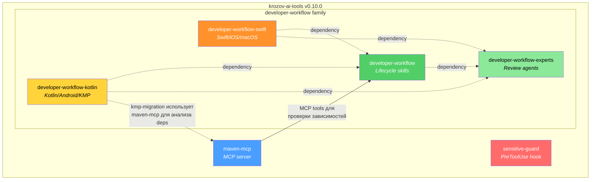
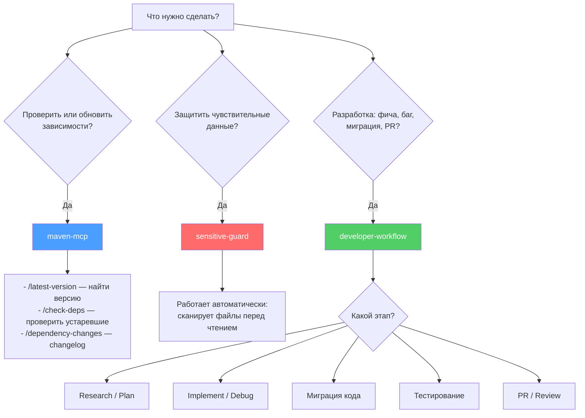
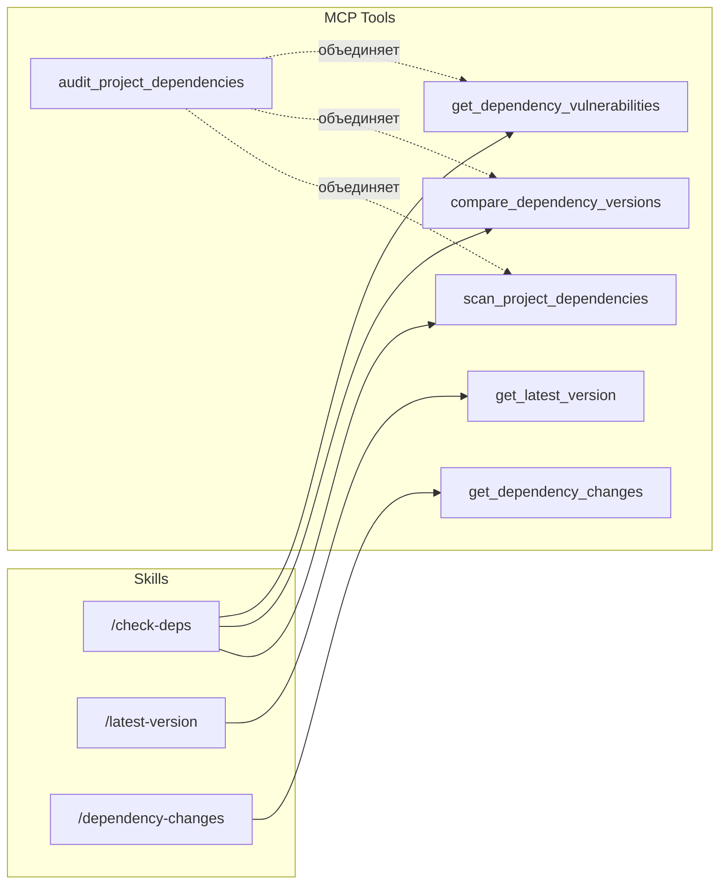
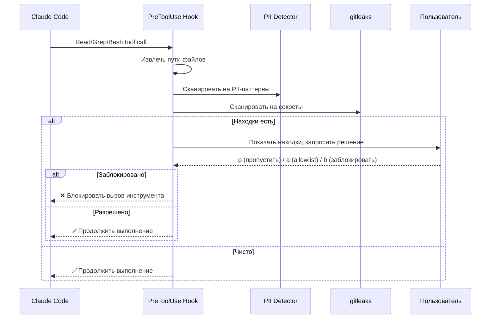
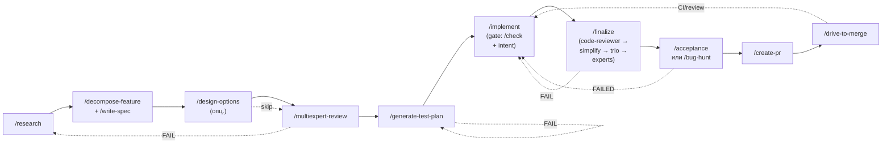
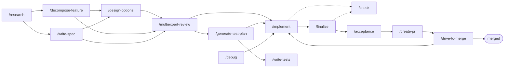

# krozov-ai-tools: Руководство по плагинам

Монорепозиторий Claude Code плагинов от krozov. Версия 0.10.0. Все плагины используют единую версионность — каждый релиз обновляет все плагины до одной версии.

Репозиторий: [github.com/kirich1409/krozov-ai-tools](https://github.com/kirich1409/krozov-ai-tools)

---

## Содержание

1. [Карта плагинов](#карта-плагинов)
2. [Дерево решений](#дерево-решений-какой-плагин-использовать)
3. [maven-mcp](#maven-mcp)
4. [sensitive-guard](#sensitive-guard)
5. [developer-workflow family](#developer-workflow-family)
6. [Справочная таблица slash-команд](#справочная-таблица-slash-команд)
7. [Установка](#установка)

---

## Карта плагинов



| Плагин | Тип | Назначение |
|--------|-----|------------|
| maven-mcp | MCP server + skills + hook | Анализ Maven-зависимостей |
| sensitive-guard | PreToolUse hook | Защита чувствительных данных |
| developer-workflow | Skills + agent | Ядро жизненного цикла разработки (17 скиллов) |
| developer-workflow-experts | Agents (9) | Переиспользуемые review-агенты (library, safe standalone) |
| developer-workflow-kotlin | Skills + agents | Kotlin/Android/KMP специалисты и migration skills |
| developer-workflow-swift | Agents + references | Swift/iOS/macOS специалисты и SwiftUI/Swift references |

---

## Дерево решений: какой плагин использовать



---

## maven-mcp

Maven dependency intelligence. MCP-сервер для запросов к Maven Central, Google Maven и custom-репозиториям. Распространяется как npm-пакет `@krozov/maven-central-mcp`.

### MCP-инструменты (9 штук)

| Инструмент | Описание |
|------------|----------|
| `get_latest_version` | Найти последнюю версию артефакта с учётом стабильности |
| `check_version_exists` | Проверить существование конкретной версии и классифицировать стабильность |
| `check_multiple_dependencies` | Массовый поиск последних версий для списка зависимостей |
| `compare_dependency_versions` | Сравнить текущие версии с последними, показать тип обновления (major/minor/patch) |
| `get_dependency_changes` | Показать изменения между двумя версиями зависимости (release notes, changelog) |
| `scan_project_dependencies` | Сканировать build-файлы проекта и извлечь все зависимости с версиями |
| `get_dependency_vulnerabilities` | Проверить зависимости на известные уязвимости (CVE) через OSV |
| `search_artifacts` | Поиск артефактов на Maven Central по ключевым словам |
| `audit_project_dependencies` | Полный аудит: сканирование + сравнение версий + проверка уязвимостей |

### Skills (3 штуки)

| Skill | Команда | Когда использовать |
|-------|---------|-------------------|
| latest-version | `/latest-version` | Нужно найти последнюю версию конкретной библиотеки |
| check-deps | `/check-deps` | Проверить все зависимости проекта на актуальность |
| dependency-changes | `/dependency-changes` | Узнать, что изменилось между версиями зависимости |

### Hook (1 штука)

| Event | Matcher | Действие |
|-------|---------|----------|
| PostToolUse | `Edit\|Write` | После редактирования build-файлов напоминает проверить зависимости |

### Поток данных: skill → tool



### Требования

- **Node.js 18+** — обязательно
- **GITHUB_TOKEN** — опционально, увеличивает лимит GitHub API с 60 до 5000 запросов/час (для `get_dependency_changes`)
- **jq** — опционально, для hook `post-edit-deps`

### Поддерживаемые build-системы

- Gradle (Groovy DSL: `build.gradle`, `settings.gradle`)
- Gradle (Kotlin DSL: `build.gradle.kts`, `settings.gradle.kts`)
- Maven (`pom.xml`)
- Version Catalogs (`gradle/libs.versions.toml`)

---

## sensitive-guard

Предотвращает попадание секретов и персональных данных (PII) на серверы AI, сканируя файлы до того, как они будут прочитаны в контекст.

### Принцип работы



### Перехватываемые инструменты

| Инструмент | Что сканируется |
|------------|----------------|
| `Read` | Файл по указанному пути |
| `Grep` | Файлы в результатах поиска |
| `Bash` | Файлы, извлечённые из команд (`cat`, `head`, `tail`, `less`, `source`, `grep <file>`, `< file`) |

### Встроенные PII-паттерны

| ID | Описание | По умолчанию |
|----|----------|-------------|
| `email` | Email-адреса | включён |
| `ssn` | US SSN (xxx-xx-xxxx) | включён |
| `credit_card` | Номера кредитных карт | включён |
| `iban` | IBAN | включён |
| `phone` | Телефонные номера (международные) | выключен — много false positives |
| `ipv4` | IPv4-адреса | выключен — конфликтует со строками версий |

### Конфигурация

Три слоя (каждый следующий переопределяет предыдущий):

| Слой | Расположение | Приоритет |
|------|-------------|-----------|
| По умолчанию | Встроен в плагин (`config/default-config.json`) | Низкий |
| Глобальный | `~/.claude/sensitive-guard.json` | Средний |
| Проектный | `.claude/sensitive-guard.json` | Высокий |

Основные параметры:

```json
{
  "tools": ["Read", "Grep", "Bash"],
  "pii": {
    "enabled": true,
    "disabled": ["ipv4", "phone"],
    "custom": [{ "id": "employee_id", "regex": "EMP-[0-9]{6}", "description": "Employee ID" }]
  },
  "gitleaks": {
    "enabled": true,
    "configPath": null
  },
  "display": {
    "maxValuePreview": 12
  }
}
```

### Allowlists

| Scope | Файл |
|-------|------|
| Проектный | `.claude/sensitive-guard-allowlist.json` |
| Глобальный | `~/.claude/sensitive-guard-allowlist.json` |

Особенности:
- Значения хранятся как SHA-256 хэши, не в открытом виде
- Поддержка exact-match и pattern-based matching (regex)
- При интерактивном запросе: `p` — пропустить один раз, `a` — в проектный allowlist, `g` — в глобальный, `b` — заблокировать
- В non-interactive режиме (CI, headless) все находки блокируются

### Требования

- **jq** — обязательно
- **perl** — обязательно (предустановлен на macOS и большинстве Linux)
- **gitleaks** — рекомендуется (без него работает только PII detection)

---

## developer-workflow family

Семейство из четырёх взаимосвязанных плагинов, покрывающих полный цикл разработки — от исследования и планирования до создания PR и его мержа.

| Плагин | Содержимое |
|--------|-----------|
| `developer-workflow` | Ядро: 17 lifecycle-скиллов + 1 QA-агент (`manual-tester`) |
| `developer-workflow-experts` | 9 review/consult-агентов (library, безопасен standalone) |
| `developer-workflow-kotlin` | 3 migration-скилла + Kotlin/Compose engineer-агенты |
| `developer-workflow-swift` | Swift/SwiftUI engineer-агенты + Swift/SwiftUI references |

Установка любого из `developer-workflow`, `-kotlin`, `-swift` автоматически подтянет зависимости через `dependencies` в `plugin.json`.

### Обзор pipeline



Оркестраторы `/feature-flow` и `/bugfix-flow` автоматизируют обход этой цепочки. Полные диаграммы с stop-points и backward-transition лимитами — в [`plugins/developer-workflow/docs/ORCHESTRATORS.md`](../plugins/developer-workflow/docs/ORCHESTRATORS.md).

---

### developer-workflow (core)

17 lifecycle-скиллов и 1 QA-агент. Только оркестрация — никаких platform-specific инженеров.

#### Skills: Research и Planning

| Skill | Команда | Назначение |
|-------|---------|------------|
| research | `/research` | Параллельное исследование до 5 экспертами: codebase, web, docs, deps, architecture |
| decompose-feature | `/decompose-feature` | Декомпозиция фичи/PRD/эпика в структурированный список задач с зависимостями |
| write-spec | `/write-spec` | Написание технической спецификации из исследования или decompose |
| design-options | `/design-options` | Опциональный pre-review шаг: 2–3 альтернативных архитектурных варианта для high-arch-risk задач |
| multiexpert-review | `/multiexpert-review` | Multi-agent ревью плана, спеки или test-plan'а через соответствующий профиль по протоколу PoLL (Panel of LLM Evaluators) |

#### Skills: Implementation

| Skill | Команда | Назначение |
|-------|---------|------------|
| implement | `/implement` | Реализация задачи с двумя gates: mechanical (через `/check`) и intent |
| write-tests | `/write-tests` | Ретроактивное написание тестов для существующего кода |
| debug | `/debug` | Систематический поиск root cause до попытки исправления |

#### Skills: Verification и Quality

| Skill | Команда | Назначение |
|-------|---------|------------|
| check | `/check` | Mechanical-check runner (build + lint + typecheck + tests, fail-fast) с автодетектом стека. Используется `implement`, `finalize` и любым code-modifying скиллом |
| finalize | `/finalize` | Multi-phase review-and-fix loop между `implement` и `acceptance`: code-reviewer → `/simplify` → pr-review-toolkit trio → условные expert reviews, `/check` между фиксами |

#### Skills: Testing / QA

| Skill | Команда | Назначение |
|-------|---------|------------|
| generate-test-plan | `/generate-test-plan` | Создание тест-плана и QA-сценариев |
| acceptance | `/acceptance` | Верификация фичи на живом приложении по спецификации |
| bug-hunt | `/bug-hunt` | Undirected QA: поиск багов без спецификации |

#### Skills: PR

| Skill | Команда | Назначение |
|-------|---------|------------|
| create-pr | `/create-pr` | Создание PR/MR: push, draft/ready, описание, reviewers |
| drive-to-merge | `/drive-to-merge` | Автономный оркестратор после создания PR: мониторит CI, диагностирует падения, фетчит комменты, категоризирует их inline, предлагает конкретные фиксы (edit-сниппет или делегирование в `implement`/`debug`), пушит, отвечает в треды, резолвит, запрашивает повторное ревью (Copilot + люди), поллит активность через `ScheduleWakeup`, доводит PR до merge. Финальный merge всегда требует явного подтверждения пользователя. Режимы: default (ждёт `approve` между раундами), `--auto` (не ждёт), `--dry-run` (только анализ) |

#### Skills: Orchestrators

| Skill | Команда | Назначение |
|-------|---------|------------|
| feature-flow | `/feature-flow` | Тонкий state-machine оркестратор полного цикла feature: setup → research → decompose/plan → design-options → multiexpert-review → test-plan → implement → finalize → acceptance → create-pr → drive-to-merge |
| bugfix-flow | `/bugfix-flow` | Тонкий оркестратор bugfix: setup → debug → (plan → multiexpert-review) → implement → finalize → acceptance → create-pr → drive-to-merge |

Оба оркестратора содержат только routing-логику (никакой implementation logic) со stop-points и backward-transition лимитами.

#### Agent: QA

| Agent | Роль | Model | Режим |
|-------|------|-------|-------|
| manual-tester | Ручное QA: тест-кейсы, выполнение на устройстве, баг-репорты | sonnet | read-only (использует mobile / playwright MCP) |

---

### developer-workflow-experts

9 переиспользуемых review/consult-агентов. Plugin безопасен standalone — не содержит скиллов, хуков или MCP. Автоматически устанавливается как зависимость core.

| Agent | Роль | Model | Режим |
|-------|------|-------|-------|
| architecture-expert | Модульная структура, зависимости, API design | opus | read-only |
| build-engineer | Gradle, AGP, KMP source sets, convention plugins | sonnet | read-write |
| business-analyst | Требования, scope, MVP, acceptance criteria | opus | read-only |
| code-reviewer | Независимое ревью diff; используется в `finalize` и `acceptance` | sonnet | read-only |
| debugging-expert | Поиск root cause: stack traces, call paths, binary search | sonnet | read-only |
| devops-expert | CI/CD, Docker, release automation, dependency scanning | sonnet | read-write |
| performance-expert | N+1, memory leaks, jank, recomposition, батарея | sonnet | read-only |
| security-expert | OWASP, auth flows, token storage, TLS, secrets management | opus | read-only |
| ux-expert | UX ревью, accessibility, навигация, platform conventions | sonnet | read-only |

---

### developer-workflow-kotlin

Специализация для Kotlin/Android/KMP. Устанавливать для Kotlin-разработки.

#### Skills: Migration

| Skill | Команда | Назначение |
|-------|---------|------------|
| code-migration | `/code-migration` | Замена технологии/библиотеки с гарантией поведенческой эквивалентности |
| kmp-migration | `/kmp-migration` | Миграция Android-модуля в Kotlin Multiplatform |
| migrate-to-compose | `/migrate-to-compose` | Миграция View-based UI в Jetpack Compose |

#### Agents

| Agent | Роль | Model | Может редактировать |
|-------|------|-------|-------------------|
| kotlin-engineer | Kotlin-код: ViewModel, UseCase, Repository, DI, тесты | sonnet | да |
| compose-developer | Compose UI: screens, composables, themes, navigation, animations | sonnet | да |

---

### developer-workflow-swift

Специализация для Swift/iOS/macOS. Устанавливать для Swift-разработки.

#### Agents

| Agent | Роль | Model | Может редактировать |
|-------|------|-------|-------------------|
| swift-engineer | Swift-код: модели, сервисы, networking, platform code | sonnet | да |
| swiftui-developer | SwiftUI: views, navigation, modifiers, previews | sonnet | да |

Также содержит reference-скиллы: Swift concurrency, testing, SwiftUI patterns/state/performance.

---

### Связи skill → agent

```mermaid
flowchart TB
    subgraph core ["developer-workflow (core)"]
        impl[/implement/]
        debug[/debug/]
        research[/research/]
        decompose[/decompose-feature/]
        planReview[/multiexpert-review/]
        design[/design-options/]
        finalize[/finalize/]
        writeTest[/write-tests/]
        testFeat[/acceptance/]
        explTest[/bug-hunt/]
        mt[manual-tester]
    end

    subgraph kotlin_p ["developer-workflow-kotlin"]
        migrate[/migrate-to-compose/]
        kmp[/kmp-migration/]
        codeMig[/code-migration/]
        ke[kotlin-engineer]
        cd[compose-developer]
    end

    subgraph swift_p ["developer-workflow-swift"]
        se[swift-engineer]
        sd[swiftui-developer]
    end

    subgraph experts_p ["developer-workflow-experts"]
        arch[architecture-expert]
        build[build-engineer]
        ba[business-analyst]
        cr[code-reviewer]
        de[debugging-expert]
        devops[devops-expert]
        perf[performance-expert]
        sec[security-expert]
        ux[ux-expert]
    end

    impl --> ke & cd & se & sd
    migrate --> cd
    kmp --> ke
    codeMig --> ke & cd
    debug --> de
    research --> arch & ba
    decompose --> arch & ba
    design --> arch
    planReview --> arch & ba & sec & perf & ux
    finalize --> cr & arch & sec & perf & ux
    testFeat --> mt
    explTest --> mt
    writeTest --> ke & se
```



### Связи skill → skill



Утилиты (`/check`) соединены пунктиром — их вызывают другие скиллы, а не оркестратор напрямую. Оркестраторы `/feature-flow` и `/bugfix-flow` автоматизируют обход этого графа.

### Модель качества

`implement` и `finalize` реализуют двухуровневую проверку качества. Подробности — в [`plugins/developer-workflow/docs/WORKFLOW.md`](../plugins/developer-workflow/docs/WORKFLOW.md).

#### Внутри `/implement` — 2 gate

| # | Gate | Описание | Исполнитель |
|---|------|----------|-------------|
| 1 | Mechanical | `/check` — build + lint + typecheck + tests (fail-fast, автодетект стека); исправления и повторный запуск до PASS | Implementation agent + `/check` |
| 2 | Intent | Перечитать задачу + план, сравнить с `git diff`, убедиться что реализовано то, что просили | Implementation agent |

#### `/finalize` — multi-phase review между `implement` и `acceptance`

Оркестратор запускает `finalize` после того, как `implement` прошёл оба gate. Каждая phase после фикса прогоняет `/check`:

| Phase | Что делает |
|-------|------------|
| A | `code-reviewer` — независимое ревью diff, фикс BLOCK-findings |
| B | `/simplify` — авто-рефакторинг на упрощение |
| C | pr-review-toolkit trio (параллельно) — фикс BLOCK |
| D | Experts (условно, параллельно) — architecture / security / performance / ux; фикс BLOCK |

Лимит: 3 раунда; после 3 — escalate to user (`ESCALATE (3 rounds)` в оркестраторе).

### Требования

- **gh CLI / glab CLI** — обязательно для `create-pr` и `drive-to-merge`. Без рабочей авторизации скилл не может автономно пушить фиксы, постить ответы и резолвить треды; при отсутствии CLI — попросит установить и авторизоваться, затем повторно запустить
- **mobile MCP** — обязательно для live mobile QA (`acceptance`, `bug-hunt`, `manual-tester`); при отсутствии QA-скиллы останавливаются с просьбой включить
- **playwright MCP** — рекомендуется для browser-based QA

---

## Справочная таблица slash-команд

| Команда | Плагин | Описание |
|---------|--------|----------|
| `/latest-version` | maven-mcp | Найти последнюю версию Maven-артефакта |
| `/check-deps` | maven-mcp | Проверить все зависимости проекта на обновления |
| `/dependency-changes` | maven-mcp | Показать changelog между версиями зависимости |
| `/research` | developer-workflow | Параллельное исследование темы экспертами |
| `/decompose-feature` | developer-workflow | Декомпозиция фичи в список задач |
| `/write-spec` | developer-workflow | Написание технической спецификации |
| `/design-options` | developer-workflow | 2–3 альтернативных архитектурных варианта (опционально, для high-arch-risk задач) |
| `/multiexpert-review` | developer-workflow | Multi-agent ревью плана, спеки или test-plan'а (PoLL) |
| `/implement` | developer-workflow | Реализация с двумя gates: mechanical (`/check`) и intent |
| `/check` | developer-workflow | Mechanical-check runner: build + lint + typecheck + tests, автодетект стека |
| `/finalize` | developer-workflow | Multi-phase code-quality pass между implement и acceptance |
| `/debug` | developer-workflow | Систематический поиск root cause |
| `/generate-test-plan` | developer-workflow | Создание тест-плана |
| `/write-tests` | developer-workflow | Написание тестов для существующего кода |
| `/acceptance` | developer-workflow | Верификация фичи на устройстве |
| `/bug-hunt` | developer-workflow | Поиск багов без спецификации |
| `/create-pr` | developer-workflow | Создание pull request |
| `/drive-to-merge` | developer-workflow | Автономный CI+review loop: categorize → propose concrete fix → delegate → reply → resolve → re-request review (Copilot + люди) → poll → merge (с подтверждением пользователя) |
| `/feature-flow` | developer-workflow | Оркестратор полного цикла feature (setup → research → plan → implement → PR → merge) |
| `/bugfix-flow` | developer-workflow | Оркестратор bugfix (setup → debug → implement → PR → merge) |
| `/code-migration` | developer-workflow-kotlin | Миграция технологии/библиотеки |
| `/kmp-migration` | developer-workflow-kotlin | Миграция модуля в Kotlin Multiplatform |
| `/migrate-to-compose` | developer-workflow-kotlin | Миграция View → Compose |

---

## Установка

### Добавить marketplace

```
/plugin marketplace add kirich1409/krozov-ai-tools
```

### Отдельные плагины

```
/plugin install maven-mcp@krozov-ai-tools
/plugin install sensitive-guard@krozov-ai-tools
/plugin install developer-workflow@krozov-ai-tools
/plugin install developer-workflow-experts@krozov-ai-tools
/plugin install developer-workflow-kotlin@krozov-ai-tools
/plugin install developer-workflow-swift@krozov-ai-tools
```

Установка любого из `developer-workflow`, `developer-workflow-kotlin` или `developer-workflow-swift` автоматически подтянет их зависимости (`developer-workflow-experts` и — для платформенных плагинов — `developer-workflow` core).
