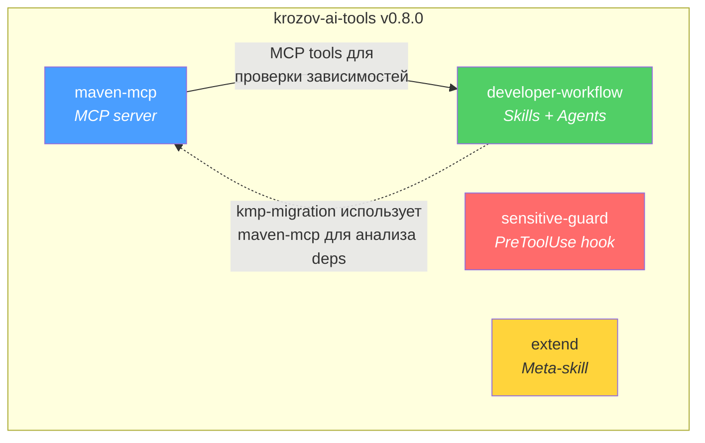
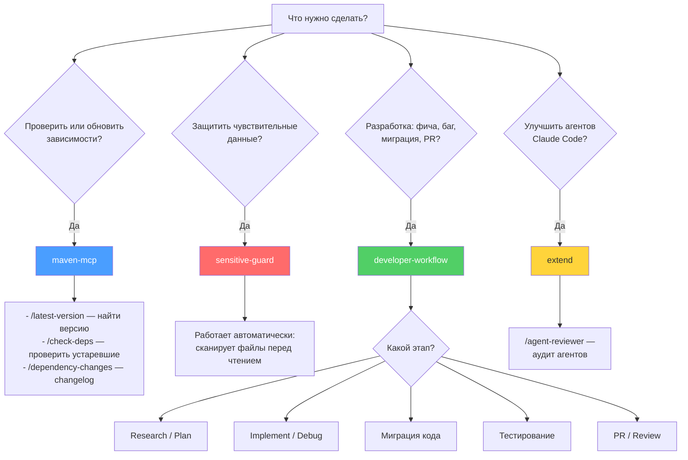
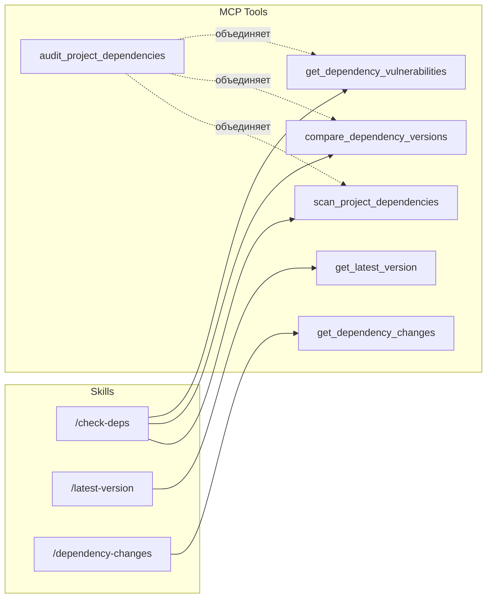
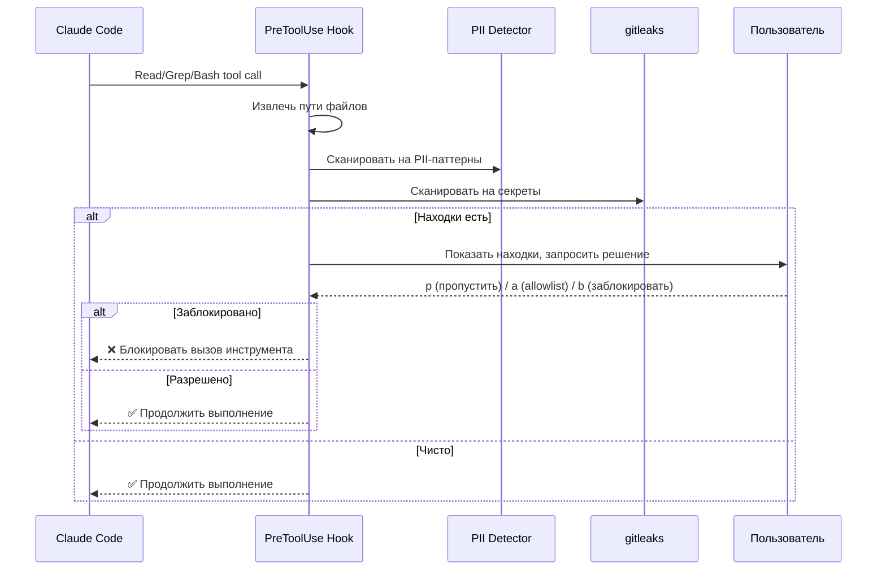
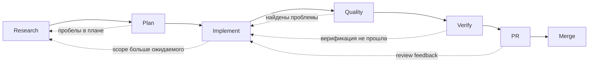
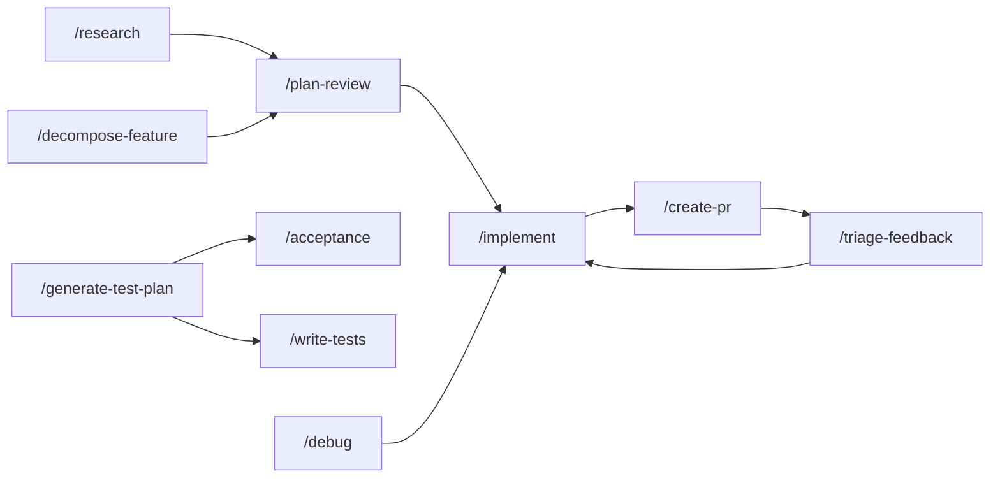

# krozov-ai-tools: Руководство по плагинам

Монорепозиторий Claude Code плагинов от krozov. Версия 0.8.0. Все плагины используют единую версионность — каждый релиз обновляет все плагины до одной версии.

Репозиторий: [github.com/kirich1409/krozov-ai-tools](https://github.com/kirich1409/krozov-ai-tools)

---

## Содержание

1. [Карта плагинов](#карта-плагинов)
2. [Дерево решений](#дерево-решений-какой-плагин-использовать)
3. [maven-mcp](#maven-mcp)
4. [sensitive-guard](#sensitive-guard)
5. [developer-workflow](#developer-workflow)
6. [extend](#extend)
7. [Справочная таблица slash-команд](#справочная-таблица-slash-команд)
8. [Установка](#установка)

---

## Карта плагинов



| Плагин | Тип | Назначение |
|--------|-----|------------|
| maven-mcp | MCP server + skills + hook | Анализ Maven-зависимостей |
| sensitive-guard | PreToolUse hook | Защита чувствительных данных |
| developer-workflow | Skills + agents | Полный цикл разработки |
| extend | Meta-skill | Улучшение агентов Claude Code |

---

## Дерево решений: какой плагин использовать



---

## maven-mcp

Maven dependency intelligence. MCP-сервер для запросов к Maven Central, Google Maven и custom-репозиториям. Распространяется как npm-пакет `@krozov/maven-central-mcp`.

### MCP-инструменты (9 штук)

| Инструмент | Описание |
|------------|----------|
| `get_latest_version` | Найти последнюю версию артефакта с учётом стабильности |
| `check_version_exists` | Проверить существование конкретной версии и классифицировать стабильность |
| `check_multiple_dependencies` | Массовый поиск последних версий для списка зависимостей |
| `compare_dependency_versions` | Сравнить текущие версии с последними, показать тип обновления (major/minor/patch) |
| `get_dependency_changes` | Показать изменения между двумя версиями зависимости (release notes, changelog) |
| `scan_project_dependencies` | Сканировать build-файлы проекта и извлечь все зависимости с версиями |
| `get_dependency_vulnerabilities` | Проверить зависимости на известные уязвимости (CVE) через OSV |
| `search_artifacts` | Поиск артефактов на Maven Central по ключевым словам |
| `audit_project_dependencies` | Полный аудит: сканирование + сравнение версий + проверка уязвимостей |

### Skills (3 штуки)

| Skill | Команда | Когда использовать |
|-------|---------|-------------------|
| latest-version | `/latest-version` | Нужно найти последнюю версию конкретной библиотеки |
| check-deps | `/check-deps` | Проверить все зависимости проекта на актуальность |
| dependency-changes | `/dependency-changes` | Узнать, что изменилось между версиями зависимости |

### Hook (1 штука)

| Event | Matcher | Действие |
|-------|---------|----------|
| PostToolUse | `Edit\|Write` | После редактирования build-файлов напоминает проверить зависимости |

### Поток данных: skill → tool



### Требования

- **Node.js 18+** — обязательно
- **GITHUB_TOKEN** — опционально, увеличивает лимит GitHub API с 60 до 5000 запросов/час (для `get_dependency_changes`)
- **jq** — опционально, для hook `post-edit-deps`

### Поддерживаемые build-системы

- Gradle (Groovy DSL: `build.gradle`, `settings.gradle`)
- Gradle (Kotlin DSL: `build.gradle.kts`, `settings.gradle.kts`)
- Maven (`pom.xml`)
- Version Catalogs (`gradle/libs.versions.toml`)

---

## sensitive-guard

Предотвращает попадание секретов и персональных данных (PII) на серверы AI, сканируя файлы до того, как они будут прочитаны в контекст.

### Принцип работы



### Перехватываемые инструменты

| Инструмент | Что сканируется |
|------------|----------------|
| `Read` | Файл по указанному пути |
| `Grep` | Файлы в результатах поиска |
| `Bash` | Файлы, извлечённые из команд (`cat`, `head`, `tail`, `less`, `source`, `grep <file>`, `< file`) |

### Встроенные PII-паттерны

| ID | Описание | По умолчанию |
|----|----------|-------------|
| `email` | Email-адреса | включён |
| `ssn` | US SSN (xxx-xx-xxxx) | включён |
| `credit_card` | Номера кредитных карт | включён |
| `iban` | IBAN | включён |
| `phone` | Телефонные номера (международные) | выключен — много false positives |
| `ipv4` | IPv4-адреса | выключен — конфликтует со строками версий |

### Конфигурация

Три слоя (каждый следующий переопределяет предыдущий):

| Слой | Расположение | Приоритет |
|------|-------------|-----------|
| По умолчанию | Встроен в плагин (`config/default-config.json`) | Низкий |
| Глобальный | `~/.claude/sensitive-guard.json` | Средний |
| Проектный | `.claude/sensitive-guard.json` | Высокий |

Основные параметры:

```json
{
  "tools": ["Read", "Grep", "Bash"],
  "pii": {
    "enabled": true,
    "disabled": ["ipv4", "phone"],
    "custom": [{ "id": "employee_id", "regex": "EMP-[0-9]{6}", "description": "Employee ID" }]
  },
  "gitleaks": {
    "enabled": true,
    "configPath": null
  },
  "display": {
    "maxValuePreview": 12
  }
}
```

### Allowlists

| Scope | Файл |
|-------|------|
| Проектный | `.claude/sensitive-guard-allowlist.json` |
| Глобальный | `~/.claude/sensitive-guard-allowlist.json` |

Особенности:
- Значения хранятся как SHA-256 хэши, не в открытом виде
- Поддержка exact-match и pattern-based matching (regex)
- При интерактивном запросе: `p` — пропустить один раз, `a` — в проектный allowlist, `g` — в глобальный, `b` — заблокировать
- В non-interactive режиме (CI, headless) все находки блокируются

### Требования

- **jq** — обязательно
- **perl** — обязательно (предустановлен на macOS и большинстве Linux)
- **gitleaks** — рекомендуется (без него работает только PII detection)

---

## developer-workflow

Полная автоматизация жизненного цикла разработки: от исследования и планирования до создания PR и его мержа.

### Обзор pipeline



### Skills: Research и Planning

| Skill | Команда | Назначение |
|-------|---------|------------|
| research | `/research` | Параллельное исследование до 5 экспертами: codebase, web, docs, deps, architecture |
| decompose-feature | `/decompose-feature` | Декомпозиция фичи/PRD/эпика в структурированный список задач с зависимостями |
| plan-review | `/plan-review` | Multi-agent ревью плана по протоколу PoLL (Panel of LLM Evaluators) |

### Skills: Implementation

| Skill | Команда | Назначение |
|-------|---------|------------|
| implement | `/implement` | Standalone-стадия реализации: код → simplify → quality loop |
| debug | `/debug` | Систематический поиск root cause до попытки исправления |

### Skills: Migration

| Skill | Команда | Назначение |
|-------|---------|------------|
| code-migration | `/code-migration` | Замена технологии/библиотеки с гарантией поведенческой эквивалентности |
| kmp-migration | `/kmp-migration` | Миграция Android-модуля в Kotlin Multiplatform |
| migrate-to-compose | `/migrate-to-compose` | Миграция View-based UI в Jetpack Compose |

### Skills: Testing

| Skill | Команда | Назначение |
|-------|---------|------------|
| generate-test-plan | `/generate-test-plan` | Создание тест-плана и QA-сценариев |
| write-tests | `/write-tests` | Ретроактивное написание тестов для существующего кода |
| acceptance | `/acceptance` | Верификация фичи на живом приложении по спецификации |
| bug-hunt | `/bug-hunt` | Undirected QA: поиск багов без спецификации |

### Skills: Review и PR

| Skill | Команда | Назначение |
|-------|---------|------------|
| create-pr | `/create-pr` | Создание PR/MR: push, draft/ready, описание, reviewers |
| triage-feedback | `/triage-feedback` | Анализ фидбэка (PR-комментарии или текст пользователя): категоризация, приоритизация, паттерны, отчёт. Опционально: dismiss-ответы и resolve тредов для терминальных вердиктов (PRAISE / OUT_OF_SCOPE / NO_ACTION) через editable manifest по явному apply-триггеру — без правок кода |

### Agents: Implementation

| Agent | Роль | Model | Может редактировать |
|-------|------|-------|-------------------|
| kotlin-engineer | Kotlin-код: ViewModel, UseCase, Repository, DI, тесты | sonnet | да |
| compose-developer | Compose UI: screens, composables, themes, navigation, animations | sonnet | да |
| swift-engineer | Swift-код: модели, сервисы, networking, platform code | sonnet | да |
| swiftui-developer | SwiftUI: views, navigation, modifiers, previews | sonnet | да |

### Agents: Experts

| Agent | Роль | Model | Режим |
|-------|------|-------|-------|
| architecture-expert | Модульная структура, зависимости, API design | opus | read-only |
| build-engineer | Gradle, AGP, KMP source sets, convention plugins | sonnet | read-write |
| business-analyst | Требования, scope, MVP, acceptance criteria | opus | read-only |
| code-reviewer | Независимый ревью для Quality Loop gate 4 | sonnet | read-only |
| debugging-expert | Поиск root cause: stack traces, call paths, binary search | sonnet | read-only |
| devops-expert | CI/CD, Docker, release automation, dependency scanning | sonnet | read-write |
| performance-expert | N+1, memory leaks, jank, recomposition, батарея | sonnet | read-only |
| security-expert | OWASP, auth flows, token storage, TLS, secrets management | opus | read-only |
| ux-expert | UX ревью, accessibility, навигация, platform conventions | sonnet | read-only |

### Agent: QA

| Agent | Роль | Model | Режим |
|-------|------|-------|-------|
| manual-tester | Ручное QA: тест-кейсы, выполнение на устройстве, баг-репорты | sonnet | read-only (использует mobile MCP) |

### Связи skill → agent

```mermaid
flowchart TB
    subgraph Skills
        impl[implement]
        migrate[migrate-to-compose]
        kmp[kmp-migration]
        codeMig[code-migration]
        debug[debug]
        createPR[create-pr]
        triage[triage-feedback]
        testFeat[acceptance]
        explTest[bug-hunt]
        writeTest[write-tests]
        research[research]
        decompose[decompose-feature]
        planReview[plan-review]
    end

    subgraph Implementation Agents
        ke[kotlin-engineer]
        cd[compose-developer]
        se[swift-engineer]
        sd[swiftui-developer]
    end

    subgraph Expert Agents
        arch[architecture-expert]
        build[build-engineer]
        ba[business-analyst]
        cr[code-reviewer]
        de[debugging-expert]
        devops[devops-expert]
        perf[performance-expert]
        sec[security-expert]
        ux[ux-expert]
    end

    subgraph QA
        mt[manual-tester]
    end

    impl --> ke & cd & se & sd
    migrate --> cd
    kmp --> ke
    codeMig --> ke & cd
    debug --> de
    research --> arch & ba
    decompose --> arch & ba
    planReview --> arch & ba & sec & perf & ux
    testFeat --> mt
    explTest --> mt
    writeTest --> ke & se
```



### Связи skill → skill



### Quality Loop: gates

Quality Loop запускается после реализации и перед созданием PR. Gates выполняются последовательно; провал gate запускает цикл исправления.

| # | Gate | Описание | Agent |
|---|------|----------|-------|
| 1 | Build | Компиляция проекта, устранение всех ошибок | Implementation agent |
| 2 | Static analysis | Lint, форматирование, unused imports — исправить нарушения | Implementation agent |
| 3 | Tests | Запуск unit + integration тестов, исправить провалы | Implementation agent |
| 4 | Semantic self-review | Сравнение оригинального intent с actual `git diff` | code-reviewer (независимый) |
| 5 | Expert reviews | Параллельные domain-specific ревью (только по триггерам) | security / performance / architecture |
| 6 | Intent check | Перечитать задачу + план, проверить соответствие diff | Orchestrator |

Ограничения: максимум 3 попытки исправления на gate, максимум 5 полных итераций цикла.

### Требования

- **gh CLI** — обязательно для `create-pr`; для `triage-feedback` с PR-источником рекомендуется `gh`/`glab` для автоматического получения контекста PR, но при отсутствии или неавторизованности CLI можно использовать fallback: вставить PR-контекст вручную (URL + комментарии + diff) — skill обработает его как user-text source
- **mobile MCP** — опционально, для тестирования на устройстве (`acceptance`, `bug-hunt`). Без него UI-проверки пропускаются

---

## extend

Meta-инструменты для улучшения самих агентов Claude Code.

### Skill: agent-reviewer

| Команда | `/agent-reviewer` |
|---------|-------------------|
| Назначение | Аудит агентов Claude Code |

Что проверяет:
- Frontmatter: корректность `name`, `description`, `model`, `tools`, `color`, `memory`
- Качество промпта: ясность инструкций, полнота контекста
- Выбор инструментов: правильность `tools` и `disallowedTools`
- Точность триггеров: соответствие `description` реальным use cases
- Анти-паттерны: конфликты, дублирование, избыточность

Когда использовать:
- После создания или модификации агента
- Перед деплоем нового агента в production
- При отладке проблем с триггерами агента

---

## Справочная таблица slash-команд

| Команда | Плагин | Описание |
|---------|--------|----------|
| `/latest-version` | maven-mcp | Найти последнюю версию Maven-артефакта |
| `/check-deps` | maven-mcp | Проверить все зависимости проекта на обновления |
| `/dependency-changes` | maven-mcp | Показать changelog между версиями зависимости |
| `/research` | developer-workflow | Параллельное исследование темы экспертами |
| `/decompose-feature` | developer-workflow | Декомпозиция фичи в список задач |
| `/plan-review` | developer-workflow | Multi-agent ревью плана (PoLL) |
| `/implement` | developer-workflow | Standalone-стадия реализации с quality loop |
| `/debug` | developer-workflow | Систематический поиск root cause |
| `/code-migration` | developer-workflow | Миграция технологии/библиотеки |
| `/kmp-migration` | developer-workflow | Миграция модуля в KMP |
| `/migrate-to-compose` | developer-workflow | Миграция View → Compose |
| `/generate-test-plan` | developer-workflow | Создание тест-плана |
| `/write-tests` | developer-workflow | Написание тестов для существующего кода |
| `/acceptance` | developer-workflow | Верификация фичи на устройстве |
| `/bug-hunt` | developer-workflow | Поиск багов без спецификации |
| `/create-pr` | developer-workflow | Создание pull request |
| `/triage-feedback` | developer-workflow | Анализ фидбэка: категоризация, приоритизация, паттерны; опционально — dismiss/resolve терминальных вердиктов через manifest |
| `/agent-reviewer` | extend | Аудит агента Claude Code |

---

## Установка

### Из marketplace (все плагины)

```bash
claude plugin add kirich1409/krozov-ai-tools
```

### Отдельные плагины

```bash
# maven-mcp
claude plugin add kirich1409/krozov-ai-tools --plugin maven-mcp

# sensitive-guard
claude plugin add kirich1409/krozov-ai-tools --plugin sensitive-guard

# developer-workflow
claude plugin add kirich1409/krozov-ai-tools --plugin developer-workflow

# extend
claude plugin add kirich1409/krozov-ai-tools --plugin extend
```

### Из локального пути (для разработки)

```bash
claude plugin add /path/to/krozov-ai-tools/plugins/maven-mcp/plugin
claude plugin add /path/to/krozov-ai-tools/plugins/sensitive-guard
claude plugin add /path/to/krozov-ai-tools/plugins/developer-workflow
claude plugin add /path/to/krozov-ai-tools/plugins/extend
```
