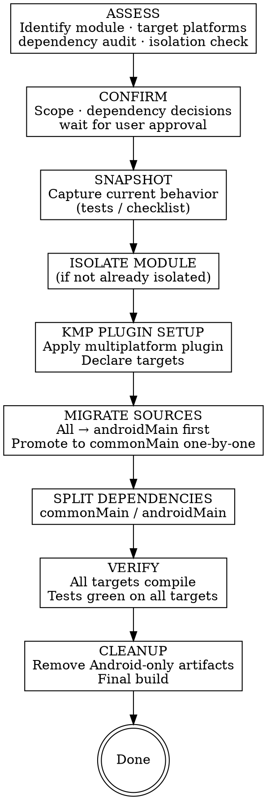

# KMP Migration

## Overview

**Core principle:** Assess what can move to common → audit dependency compatibility → isolate module → migrate sources to the right source sets → verify on all targets → clean up Android-only artifacts.

KMP migration is a structural change. Code in `commonMain` must compile without any Android SDK — the Kotlin compiler enforces this strictly. Never start moving sources before the dependency audit is done.

## Workflow

## Phase 1: Assess

### 1. Identify the migration target and confirm platforms

Read the module(s). Understand what it does and whether it's already isolated. **Confirm target platforms before anything else** — they determine every subsequent decision:

| Target combination | Typical use case |
|--------------------|-----------------|
| Android + iOS | Share business logic with an iOS app |
| Android + JVM | Share with a backend/server module |
| Android + iOS + JVM | Full KMP — maximum sharing |
| Android + iOS + Desktop | Compose Multiplatform UI |

### 2. Check module isolation

**Extraction to a dedicated Gradle module is a hard prerequisite.** Code cannot partially live in `commonMain`.
- Already isolated → proceed
- Mixed into a large module → propose isolation as preparation PR first

### 3. Kotlin version check

**Strongly recommend Kotlin 2.x** for new KMP work. Always run `maven-mcp:latest-version org.jetbrains.kotlin:kotlin-gradle-plugin` to find the current latest stable version.

| Current version | Recommendation |
|-----------------|----------------|
| Latest Kotlin 2.x | Proceed |
| Older Kotlin 2.x | Upgrade to latest 2.x in same PR |
| Kotlin 1.9.x | Upgrade to latest 2.x before KMP work |
| Kotlin 1.8.x or older | Upgrade first as a separate PR |

### 4. KMP dependency compatibility audit

For every dependency, verify KMP support. **Use `maven-mcp` tools** — fastest way to verify:
- `maven-mcp:latest-version` — check KMP metadata
- `maven-mcp:dependency-changes` — assess what changed between versions
- `maven-mcp:check-deps` — scan all deps at once

**Important: `androidx.*` is NOT automatically Android-only.** Many publish KMP artifacts — always verify.

Categorize each dependency:

| Category | Meaning | Action |
|----------|---------|--------|
| **KMP-compatible now** | Current version works in `commonMain` | Move to `commonMain.dependencies` |
| **KMP available, minor update** | Newer minor version adds KMP | Bump version, move |
| **KMP only in breaking major** | Requires major version with API changes | Nested migration — assess effort separately |
| **No KMP support** | No KMP artifact exists | Find KMP alternative, keep in `androidMain`, or drop |

**Present the compatibility matrix to the user.** For each problematic dependency, offer options: migrate first (separate PR), include in same plan, keep in `androidMain`, or replace with KMP alternative.

### 5. Propose strategy options

Based on the audit, propose 1–3 options (recommended first, dismiss unfit strategies with reasons).

### 6. Save migration plan

Save to `docs/plans/kmp-migration/YYYY-MM-DD-<module-name>.md`. Generate a checklist if scope involves >1 file group. **Wait for user approval before Phase 2.**

### Bug Discovery Rule (applies in ALL phases)

Found a bug? Stop → describe to user → ask: fix now / separate task / leave as-is. **Never silently fix or ignore.**

## Phase 2: Snapshot

Produce a `behavior-spec.md` for each module. Write characterization tests in `commonTest` where possible. **All tests must pass before Phase 3.**

## Phase 3: Migrate

1. **Module isolation** (if needed) — extract, verify green, commit as standalone PR
2. **Apply KMP plugin** — see `references/migration-steps.md` for Gradle config, iOS framework setup
3. **Source directory restructure** — move all to `androidMain` first, then promote to `commonMain` one-by-one. See `references/migration-steps.md` for what-belongs-where table, `expect`/`actual` patterns, common platform concerns
4. **Split dependencies** — source-set-scoped blocks. See `references/migration-steps.md` for placement rules
5. **Compile checks** — `compileCommonMainKotlinMetadata`, `compileDebugKotlinAndroid`, `assemble` after each step

## Phase 4: Verify + Cleanup

See `references/migration-steps.md` for detailed verify commands and cleanup procedures.

1. Re-run tests on all targets
2. Walk through `behavior-spec.md` line by line — present to user
3. Cleanup: remove old deps, unconverted `dependencies {}` blocks, dead code — present list to user
4. `./gradlew build` — must be green

### Done only when ALL of the following are true:
- [ ] All Snapshot tests pass on all targets
- [ ] Behavior spec reviewed — user confirms all behaviors accounted for
- [ ] No remaining `import android.*` in `commonMain`
- [ ] Cleanup list acknowledged and all items removed
- [ ] `./gradlew build` green

## Red Flags — STOP

| Red Flag | What It Means |
|----------|---------------|
| "I'll deal with incompatible dependencies later" | Dependency audit must complete before touching sources |
| "The module isn't isolated but I'll migrate in place" | Module isolation is a hard prerequisite |
| "I'll add tests after the migration" | Snapshot must be green before Phase 3 |
| "It compiled on Android, it's probably fine in commonMain" | Run `compileCommonMainKotlinMetadata` — commonMain is stricter |
| "These old androidMain files are clearly unused" | Present removal list to user first |
| "I noticed a bug, I'll fix it quickly" | Stop, describe to user, get explicit direction |
| Using `kotlinOptions` / `compilations.all` in Kotlin 2.x | Deprecated — use `compilerOptions { }` DSL |
| "It's androidx.* so it stays in androidMain" | Wrong — check KMP metadata first with maven-mcp |
| "Implementations always stay in androidMain" | Only if their dependencies are Android-only; if deps are KMP-compatible, the impl can go to commonMain |
| Skipping target platform confirmation | Target platforms determine every subsequent decision |
