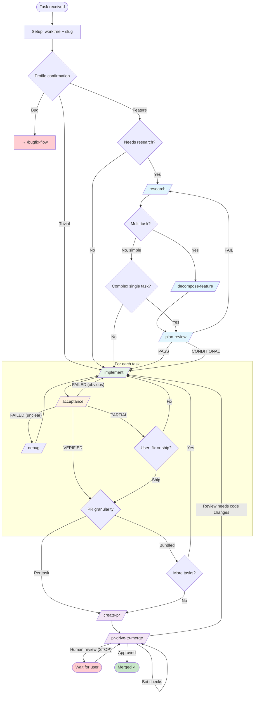
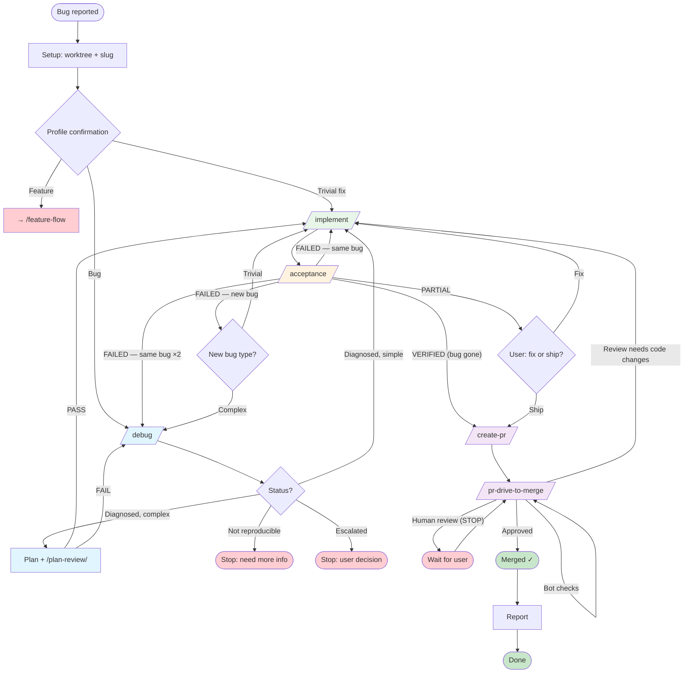

# Orchestrator Flows

Two thin orchestrators manage the full development cycle. Each routes tasks through
modular skills — no implementation logic, only state transitions.

For stage contracts and artifact formats, see [WORKFLOW.md](WORKFLOW.md).

---

## Feature Flow (`/feature-flow`)

### Stop points

| When | What happens |
|------|-------------|
| Profile confirmation | Ask user to confirm feature profile |
| PARTIAL acceptance | User decides: fix now or ship as-is |
| Human PR review | Stop, report status, resume on user command |
| Escalation | Scope explosion, 3× same failure, architectural decision needed |
| Merge confirmation | Ask before merging |

### Backward transition limits

| From → To | Max | After limit |
|-----------|-----|-------------|
| PlanReview → Research | 2 | Escalate |
| Acceptance → Implement | 3 | Escalate |
| Acceptance → Debug | 1 | Escalate |
| PR → Implement | 2 | Escalate |

---

## Bugfix Flow (`/bugfix-flow`)

### Stop points

| When | What happens |
|------|-------------|
| Profile confirmation | Ask user to confirm bug profile |
| Bug not reproducible | Stop, ask for more info |
| Debug escalation | Architectural issue or needs user decision |
| PARTIAL acceptance | User decides: fix now or ship as-is |
| Human PR review | Stop, report status, resume on user command |
| Merge confirmation | Ask before merging |

### Backward transition limits

| From → To | Max | After limit |
|-----------|-----|-------------|
| Acceptance → Implement | 3 | Escalate |
| Acceptance → Debug | 1 | Escalate |
| PR → Implement | 2 | Escalate |

---

## Stage legend

| Color | Meaning |
|-------|---------|
| 🔵 Blue | Research / diagnosis |
| 🟢 Green | Implementation |
| 🟠 Orange | Verification |
| 🟣 Purple | PR lifecycle |
| 🔴 Red | Stop / wait for user |
| ✅ Green border | Done |
