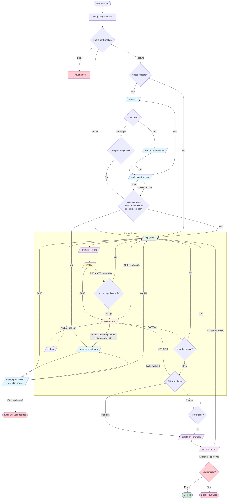
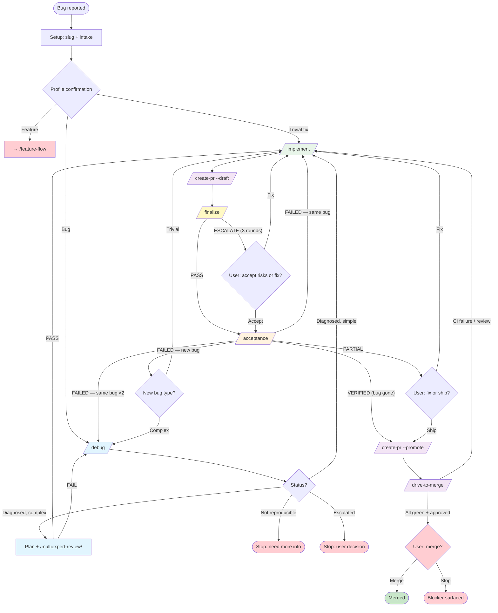

# Orchestrator Flows

Two thin orchestrators manage the full development cycle. Each routes tasks through
modular skills — no implementation logic, only state transitions.

**Preconditions (caller's responsibility).** Both orchestrators assume the caller (main
agent, wrapping agent, or user) has already prepared a working branch/worktree and the
correct working directory. The orchestrators never inspect, create, switch, or clean up
branches or worktrees.

For stage contracts and artifact formats, see [WORKFLOW.md](WORKFLOW.md).

---

## Feature Flow (`/feature-flow`)

### Stop points

| When | What happens |
|------|-------------|
| Profile confirmation | Ask user to confirm feature profile |
| PARTIAL acceptance | User decides: fix now or ship as-is |
| TestPlanReview FAIL after 3 revise cycles | User picks: accept WARN manually, revise spec, or rerun with `--skip-test-plan` |
| `drive-to-merge` merge gate | Final merge always requires explicit user confirmation — by design, regardless of mode |
| `drive-to-merge` blocker | True DISCUSSION on P0/P1, unresolvable rebase, 3× same-signature CI fail, integrity mismatch |
| Escalation | Scope explosion, 3× same failure, architectural decision needed |

### Backward transition limits

| From → To | Max | After limit |
|-----------|-----|-------------|
| PlanReview → Research | 2 | Escalate |
| TestPlanReview → TestPlan | 3 | Escalate |
| Finalize → Implement | 1 | Escalate |
| Acceptance → Implement | 3 | Escalate |
| Acceptance → TestPlan | 3 | Escalate |
| Acceptance → Debug | 1 | Escalate |
| PR → Implement | 2 | Escalate |

---

## Bugfix Flow (`/bugfix-flow`)

### Stop points

| When | What happens |
|------|-------------|
| Profile confirmation | Ask user to confirm bug profile |
| Bug not reproducible | Stop, ask for more info |
| Debug escalation | Architectural issue or needs user decision |
| PARTIAL acceptance | User decides: fix now or ship as-is |
| `drive-to-merge` merge gate | Final merge always requires explicit user confirmation — by design, regardless of mode |
| `drive-to-merge` blocker | True DISCUSSION on P0/P1, unresolvable rebase, 3× same-signature CI fail, integrity mismatch |

### Backward transition limits

| From → To | Max | After limit |
|-----------|-----|-------------|
| Finalize → Implement | 1 | Escalate |
| Acceptance → Implement | 3 | Escalate |
| Acceptance → Debug | 1 | Escalate |
| PR → Implement | 2 | Escalate |

---

## Stage legend

| Color | Meaning |
|-------|---------|
| 🔵 Blue | Research / diagnosis |
| 🟢 Green | Implementation |
| 🟡 Yellow | Finalize (code-quality loop) |
| 🟠 Orange | Acceptance |
| 🟣 Purple | PR lifecycle |
| 🔴 Red | Stop / wait for user |
| ✅ Green border | Done |
