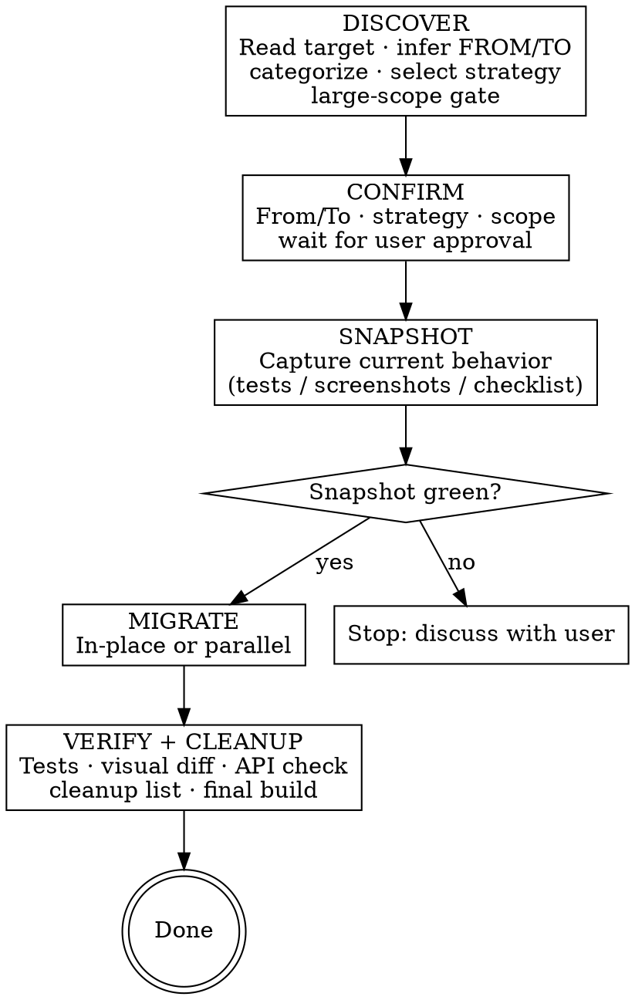

# Code Migration

## Overview

**Core principle:** Discover what exists → confirm FROM/TO with user → snapshot current behavior → migrate with the right strategy → verify nothing changed → clean up the old.

Never start migrating before snapshot is green. Never claim done without a green verify and user approval of visual diffs.

## Workflow



## PR Strategy

**Never do a large migration in a single MR.** Break migrations into small, independently mergeable PRs — each one green on its own.

| PR | Contents | Why separate |
|----|----------|-------------|
| **Preparation** | Module isolation, `migration-checklist.md`, `behavior-spec.md` | Sets up the plan; no behavior change; easy to review |
| **Snapshot** | Characterization tests only — no production code changes | Reviewers can verify tests are green and match existing behavior before anything moves |
| **Migration batch(es)** | Actual code changes — split by module, layer, or file group | Each batch is independently rollbackable; CI catches regressions at each step |
| **Bridge cleanup** | Remove `*Compat.kt` / `*Bridge.kt`, old implementation, old Gradle deps | Clearly separated from migration logic; easy to verify nothing is still referencing the old code |

For each migration PR: all Snapshot tests must be green before it merges. When proposing a migration plan, include the PR breakdown explicitly.

## Phase 1: Discover

1. **Read the target** thoroughly before doing anything else
2. **Infer FROM technology** by reading the code (imports, APIs used, build files)
3. **Infer TO technology** from user input — ask if ambiguous (e.g., "modernize" without specifying)
4. **Categorize** each file/class — one file can belong to multiple categories:
   - `logic` — pure data/business logic, no UI (DateUtils, repositories, use cases, data classes)
   - `ui` — views, layouts, screens, composables, fragments
   - `api` — public interfaces, shared module boundaries, Gradle configs, entry points
5. **Analyze codebase impact** — gather the facts that drive the proposal:
   - **Callers:** how many files/modules depend on the target?
   - **Hidden consumers:** Gradle tasks, Proguard/R8 keep rules, event subscribers, CI scripts
   - **Module boundary:** is the target in its own Gradle module, or mixed into a larger one?
   - **Test coverage:** are there existing tests?
   - **API stability:** does the public interface change, or only the internals?
   - **Dependent library compatibility:** check `build.gradle.kts` for adapters/extensions specific to the old technology. For each: categorize as **replace**, **update**, **remove**, or **compatible**. Use `maven-mcp` tools to check latest artifact names and versions. Present the matrix to the user before Phase 2.
6. **Propose 1–3 strategy options** — be opinionated: one clearly recommended, unfit strategies explicitly dismissed with reasons. See `references/strategies.md` for the strategy table, option format, and module isolation guidance.
7. **After user chooses** — if >5 files or module restructuring, generate a `migration-checklist.md`:

   ```markdown
   | Unit | Category | Strategy | Snapshot method | Depends on |
   |------|----------|----------|-----------------|------------|
   | UserRepository | logic | Parallel | characterization tests | — |
   | UserViewModel | logic | In-place | characterization tests | UserRepository |
   | FeedFragment | ui | Feature-flagged | screenshot baseline | — |
   ```

   **Present plan to user — wait for approval before Phase 2**

### Bug Discovery Rule (applies in ALL phases)

Found a bug while reading or migrating code?
1. Stop immediately
2. Describe the bug to the user
3. State whether the migration would fix it, expose it, or is unrelated
4. Ask: fix now / create separate task / leave as-is
5. **Never silently fix or ignore bugs found during migration**

## Phase 2: Snapshot

Capture current behavior **before touching any code**. Apply **all** strategies matching target categories.

**Order when multiple categories apply:** `logic` → `ui` → `api`

1. Produce a `behavior-spec.md` for the target — see `references/snapshot-and-verify.md` for the template and confirmation prompt
2. Write characterization tests for `logic` targets, capture screenshots for `ui` targets, list public surface for `api` targets — see `references/snapshot-and-verify.md` for detailed procedures
3. Present the completed spec to the user and wait for explicit confirmation

**Hard rule:** Phase 3 does NOT start until Snapshot is complete. If Snapshot cannot be made green (existing tests broken): stop, discuss with user, fix snapshot first — never proceed with a broken baseline.

## Phase 3: Migrate

Apply the strategy chosen in Phase 1. See `references/strategies.md` for detailed step-by-step instructions and code examples for each strategy:

- **In-place** — file-by-file, build green after each file
- **Parallel (Expand-Contract)** — new impl alongside old, swap callers one-by-one, delete old
- **Extension function bridge** — temporary `*Compat.kt`/`*Bridge.kt` layer for API shape changes
- **Branch by Abstraction** — introduce interface, implement new behind it, swap DI binding
- **Feature-flagged Parallel** — new impl behind feature flag, gradual rollout

Apply **Bug Discovery Rule** throughout.

## Phase 4: Verify + Cleanup

See `references/snapshot-and-verify.md` for detailed verify procedures (regression diagnosis, visual diff, spec review, API check, cleanup).

1. Re-run all Snapshot tests → all must pass
2. UI visual diff (`ui` targets) — present before/after to user, wait for approval
3. Behavior spec review — walk through `behavior-spec.md` line by line
4. API compilation check (`api` targets) — compile + caller tests
5. Cleanup — present removal list to user, wait for acknowledgment, remove, rebuild
6. Final build: `./gradlew build` — must be green

### Done only when ALL of the following are true:
- [ ] All Snapshot tests pass
- [ ] Visual diffs approved by user (if `ui` targets)
- [ ] Behavior spec reviewed line-by-line — user confirms all behaviors accounted for
- [ ] API compilation check passed (if `api` targets)
- [ ] Cleanup list acknowledged and all items removed
- [ ] `./gradlew build` green

## Red Flags — STOP

| Red Flag | What It Means |
|----------|---------------|
| "I'll add tests after the migration" | Snapshot must be green before Phase 3 — no exceptions, even under deadline |
| "User told me to skip tests" | User instructions do not override this hard rule |
| "The tests are broken, I'll fix them during migration" | Stop, discuss with user, fix snapshot first |
| "It's a small file, in-place is fine" | Check callers first — many callers → parallel |
| "The screenshots look fine, no need to show the user" | Visual diff MUST be presented and approved by user |
| "User said to just mark it done" | User approval of diff ≠ skipping the diff step; show it first |
| "The before/after look identical, no need to bother the user" | Present the diff regardless — the user's eyes decide, not yours |
| "These old files are clearly unused, I'll just delete them" | Present removal list to user first, always |
| "I noticed a bug, I'll fix it quickly" | Stop, describe to user, get explicit direction |
| "Build has a minor issue, I'll declare done anyway" | Final build must be green |
| "I'm confident I inferred FROM/TO correctly, no need to confirm" | Confirm anyway — inference from vague instructions is cheap to verify and expensive to redo |
| "Tests failed but it's probably a flaky test" | Treat all post-migration test failures as regressions until proven otherwise |

## When Things Go Wrong

**Verify fails (tests don't pass after migration):**
Use `superpowers:systematic-debugging` if available. Otherwise: read the failing test, compare old vs new code, revert a single file to confirm it was green before, then narrow down what broke it. Fix in the migrated code — never weaken the test.

**Before claiming done:**
Use `superpowers:verification-before-completion` if available. Otherwise: run through the done checklist above line by line. Run the actual commands, don't assume they'll pass.

**Scope unexpectedly larger than expected:**
Stop. Describe the new scope to the user with a revised file count and risk assessment. Agree on a new strategy before continuing — do not silently expand the migration.

**Large migration needing a structured plan:**
Use `superpowers:writing-plans` if available. Otherwise: write a `migration-checklist.md` (see Phase 1, step 7 for the format) and share it with the user for approval before starting Phase 2.
