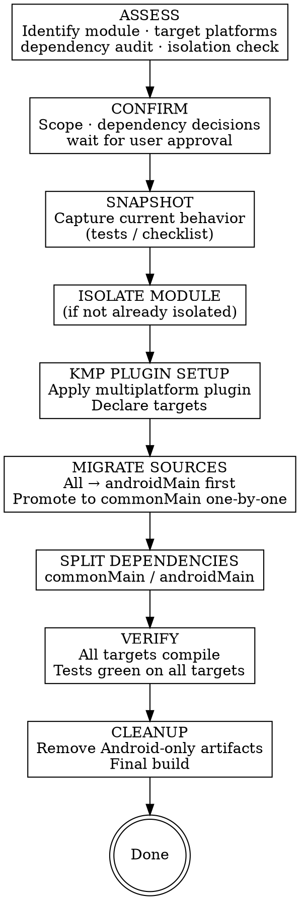

# KMP Migration

## Overview

**Core principle:** Assess what can move to common → audit dependency compatibility → isolate module → migrate sources to the right source sets → verify on all targets → clean up Android-only artifacts.

KMP migration is a structural change, not just a library swap. It changes how the project is compiled, how source files are organized, and which dependencies are visible to which targets. The key constraint: code in `commonMain` must compile without any Android SDK — the Kotlin compiler enforces this strictly.

Never start moving sources before the dependency audit is done. A dependency that has no KMP artifact will block `commonMain` compilation and force you to backtrack.

## Workflow



## Phase 1: Assess

### 1. Identify the migration target and confirm platforms

Read the module(s) the user wants to migrate. Understand:
- What it does (domain logic? data layer? networking? UI?)
- Whether it's already in its own Gradle module

**Explicitly confirm target platforms before anything else.** If the user hasn't said, propose options and wait for their answer — the platform list determines every other decision (which iOS targets to declare, which deps matter, which `expect`/`actual` patterns are needed):

| Target combination | Typical use case |
|--------------------|-----------------|
| Android + iOS | Share business logic with an iOS app |
| Android + JVM | Share with a backend/server module |
| Android + iOS + JVM | Full KMP — maximum sharing |
| Android + iOS + Desktop | Compose Multiplatform UI |

### 2. Check module isolation

**Extraction to a dedicated Gradle module is a hard prerequisite** for KMP migration. Code cannot partially live in `commonMain` — the entire module must be KMP-configured.

- Already isolated → proceed to step 3
- Mixed into a large module → propose isolation as preparation PR before any KMP work. Isolation sequence: extract → `./gradlew :new-module:assemble` green → proceed.

### 3. Kotlin version check

Check the project's Kotlin version in `libs.versions.toml` or the root `build.gradle.kts`.

**Strongly recommend Kotlin 2.x as the baseline for new KMP work.** In Kotlin 2.0+, KMP is stable (no longer experimental), the K2 compiler is default, and the `compilerOptions { }` DSL replaces the deprecated `kotlinOptions` / `compilations.all` pattern. Kotlin 2.x also brings better `expect`/`actual` strictness and improved IDE support for multiplatform code.

Always run `maven-mcp:latest-version org.jetbrains.kotlin:kotlin-gradle-plugin` to find the current latest stable version before recommending an upgrade target. Do not hardcode a version — use the verified latest.

| Current version | Recommendation |
|-----------------|----------------|
| Latest Kotlin 2.x | Proceed — use modern `compilerOptions { }` DSL throughout |
| Older Kotlin 2.x | Upgrade to latest 2.x in the same PR — low-risk, no breaking changes within 2.x |
| Kotlin 1.9.x | Upgrade to latest 2.x **before** starting KMP work — the upgrade is low-risk for most projects and is a hard prerequisite for stable KMP APIs, K2 compiler, and modern DSL |
| Kotlin 1.8.x or older | Upgrade first as a **separate PR**; older versions have experimental KMP APIs that differ significantly from 2.x |

**Why upgrading before KMP matters:** Starting KMP on Kotlin 1.9 means inheriting deprecated Gradle DSL (`kotlinOptions`, `compilations.all`), experimental multiplatform markers, and weaker `expect`/`actual` checking. Every resource, blog post, and JetBrains sample targets Kotlin 2.x. Starting on 1.9 causes immediate friction and requires re-work.

If the project needs an upgrade, use `maven-mcp:latest-version` to find the current stable Kotlin version and a compatible AGP version. Check AGP ↔ Kotlin compatibility before recommending versions. Present the upgrade plan to the user before proceeding — don't absorb it silently into the KMP scope.

### 4. KMP dependency compatibility audit

For every dependency in the target module(s), verify it has a KMP-compatible artifact. A library that works on Android may fail to compile in `commonMain` — the Kotlin compiler enforces this strictly.

Read `build.gradle.kts` / `build.gradle` and audit each dependency. **Use `maven-mcp` tools** — they are the fastest way to verify KMP support and find upgrade paths:
- `maven-mcp:latest-version` — find the latest version of a dependency and check KMP metadata
- `maven-mcp:dependency-changes` — compare your current version vs. latest to understand what changed (useful before committing to a library upgrade)
- `maven-mcp:check-deps` — scan all project deps at once for available updates

If `maven-mcp` is unavailable: search Maven Central for `<group>:<artifact>` and look for Kotlin Multiplatform mentions in the README, changelog, or published artifact metadata.

**Important: `androidx.*` is NOT automatically Android-only.** Many AndroidX libraries ship KMP artifacts that work in `commonMain`. Always check with `maven-mcp:latest-version` rather than assuming. Examples: `androidx.annotation`, `androidx.lifecycle:lifecycle-viewmodel` (partial), `androidx.datastore` (KMP support added). The key question is whether the specific library + version you use includes KMP metadata.

Categorize each dependency:

| Category | Meaning | Action |
|----------|---------|--------|
| **KMP-compatible now** | Current version works in `commonMain` for your target platforms | Move to `commonMain.dependencies` |
| **KMP available, minor update** | Newer minor version adds KMP support | Bump version, move to `commonMain.dependencies` |
| **KMP only in breaking major** | KMP support exists but requires a major version with API changes (e.g. Coil 2→3, Room 2.6.x→2.7.x) | Treat as a **nested migration** — use `maven-mcp:dependency-changes` to assess effort; offer to plan as a separate pre-step PR or include it in scope |
| **No KMP support** | No KMP artifact exists at any version | Must either: find a KMP alternative (Retrofit → Ktor, Hilt → Koin/manual DI), keep the code in `androidMain`, or drop it |

> **Room example:** Room 2.6.x is Android-only. Room 2.7.x adds KMP support. If the project is on 2.6.x, this is a nested migration — not an automatic blocker. Check the actual installed version first with `maven-mcp:latest-version`, then decide whether to upgrade Room as a pre-step or in the same plan.

**Whether code goes to `commonMain` depends on its dependencies, not whether it's an "implementation" class.** A `UserRepositoryImpl` that uses only KMP-compatible libraries (e.g. Ktor, Room 2.7.x, SQLDelight) can live in `commonMain`. Only code that actually imports Android-only APIs must stay in `androidMain`. DI wiring (Hilt modules, `@Provides`) is Android-specific infrastructure and stays in `androidMain`, but the implementation itself may not need to.

**Present the compatibility matrix to the user before Phase 2.** Each "breaking major" or "no support" entry changes the migration scope. For each such dependency, explicitly offer the user these options:
1. **Migrate the dependency first** — separate pre-step PR, lower risk
2. **Include the dependency migration in the same plan** — single PR, more scope
3. **Keep in `androidMain` only** — skip KMP for this code path for now
4. **Replace with a KMP-native alternative** — Hilt → Koin, Retrofit → Ktor, etc.

Do not absorb these decisions silently — they affect effort, risk, and strategy.

### 5. Propose strategy options

Based on the audit, propose 1–3 options. Be opinionated. Format:

> **Option A — [name]** ⭐ recommended
> Preparation: [Kotlin upgrade if needed, module isolation if needed, nested dependency migrations]
> Migration: [how sources move — all at once or layer by layer]
> PRs: [e.g., "PR 1: Kotlin upgrade, PR 2: isolation, PR 3: dependency updates, PR 4: source set migration, PR 5: cleanup"]
> Effort: low / medium / high
> Risk: low / medium / high
> Why: [1–2 sentences tied to what you found]

Dismiss strategies that don't fit with a reason — don't silently omit them.

### 6. After user approves — save migration plan and generate checklist

**Save the migration plan** to the project's docs directory before writing any code:

```
docs/plans/kmp-migration/YYYY-MM-DD-<module-name>.md
```

The plan should contain:
- Target platforms confirmed
- Dependency compatibility matrix
- Chosen strategy with reasoning
- PR sequence (e.g. "PR 1: Room upgrade, PR 2: KMP plugin + source sets")
- Any nested library migrations with their approach (separate pre-step vs. same plan)

This creates a permanent record of decisions for the team and reviewers.

If scope involves >1 file group or nested dependency migrations, also generate a **migration checklist**:
- One row per unit: name, source set destination, dependency changes, snapshot method
- **Present both the plan doc and checklist to user — wait for approval before Phase 2**

### Bug Discovery Rule (applies in ALL phases)

Found a bug while reading or migrating code?
1. Stop immediately
2. Describe the bug to the user
3. State whether the migration would fix it, expose it, or is unrelated
4. Ask: fix now / create separate task / leave as-is
5. **Never silently fix or ignore bugs found during migration**

## Phase 2: Snapshot

Capture current behavior **before touching any code**.

### Behavior Specification

Produce a `behavior-spec.md` for each module being migrated:

```markdown
# Behavior Specification: [ModuleName]
Migrating to KMP — targets: [Android / iOS / JVM]

## Public Interface
| Class / Function | Inputs | Output / Side Effect | Notes |
|---|---|---|---|

## Normal Behaviors
- [description of each significant behavior]

## Edge Cases
- [inputs at boundaries, empty collections, zero]

## Platform Assumptions (things that may need expect/actual)
- [any behavior that currently relies on Android SDK implicitly]

## Out of Scope
- [behaviors that will intentionally change]
```

**Present the spec to the user before Phase 3.**

### Logic tests

Write characterization tests in `commonTest` where possible (so they run on all targets), or `androidUnitTest` for Android-specific paths:
- Pin actual inputs/outputs including edge cases, nullability, error paths
- For async code: use `runBlocking { }` or `runTest { }` (kotlinx-coroutines-test)
- Run all tests — all must pass before Phase 3

**Hard rule:** Phase 3 does NOT start until Snapshot is complete and green.

## Phase 3: Migrate

### Step 1 — Module isolation (if needed as preparation)

If the module is mixed into a larger module:
1. Extract to `:module-name` Gradle module
2. `./gradlew :module-name:assemble` — must be green
3. Commit as a standalone PR before any KMP changes

### Step 2 — Apply KMP plugin

In `build.gradle.kts`, replace `id("com.android.library")` + `id("org.jetbrains.kotlin.android")` with the multiplatform plugin:

```kotlin
import org.jetbrains.kotlin.gradle.dsl.JvmTarget

plugins {
    alias(libs.plugins.kotlin.multiplatform)
    alias(libs.plugins.android.library)  // keep this for Android target
}

kotlin {
    androidTarget {
        compilerOptions {
            jvmTarget = JvmTarget.JVM_17
        }
    }
    // iOS targets — declare all three for device + both simulator architectures:
    iosX64()
    iosArm64()
    iosSimulatorArm64()
    // jvm()  // if also targeting JVM desktop/server
}

android {
    // android config stays here unchanged
}
```

> **Note on `kotlinOptions` / `compilations.all`:** If your project's Kotlin version is below 1.9, you may see this older style. It still works but is deprecated — prefer `compilerOptions { }` above.

**If targeting iOS**, configure the framework that Xcode will consume. Choose based on your integration approach:

**iOS integration options:**

| Option | How | Best for |
|--------|-----|----------|
| **Direct XCFramework** | `./gradlew assembleXCFramework` → embed `.xcframework` in Xcode project | Most teams starting out |
| **CocoaPods** | Apply `kotlin("native.cocoapods")` plugin, add podspec config, run `pod install` | Teams already using CocoaPods |
| **Swift Package Manager** | Embed XCFramework as a binary target in `Package.swift` | Teams using SPM |

For **CocoaPods or SPM**, add this inside the `kotlin { }` block:
```kotlin
listOf(iosX64(), iosArm64(), iosSimulatorArm64()).forEach { target ->
    target.binaries.framework {
        baseName = "ModuleName"   // the import name in Swift: import ModuleName
        isStatic = true           // static linking is simpler for most projects
    }
}
```

For **direct XCFramework**, wire each iOS target to an `XCFramework` instance inside the `kotlin { }` block:
```kotlin
val xcf = XCFramework("ModuleName")
listOf(iosX64(), iosArm64(), iosSimulatorArm64()).forEach { target ->
    target.binaries.framework {
        baseName = "ModuleName"
        isStatic = true
        xcf.add(this)
    }
}
```
Then run `./gradlew assembleXCFramework` — the output is in `build/XCFrameworks/`.

Run `./gradlew :module:assemble` — must stay green before touching any source files.

### Step 3 — Source directory restructure

**Source set directories:**
```
src/
  commonMain/kotlin/   ← platform-agnostic code (pure Kotlin, no Android SDK)
  androidMain/kotlin/  ← Android-specific (anything using android.*, Context, Activity, etc.)
  iosMain/kotlin/      ← iOS-specific implementations (if targeting iOS)
  commonTest/kotlin/   ← shared tests
  androidUnitTest/kotlin/
```

**Migration sequence — the safest path:**

1. **Move everything to `androidMain` first** — rename `src/main/kotlin` → `src/androidMain/kotlin`. The build stays green because nothing has changed logically.
2. **Split dependencies** (Step 4).
3. **Promote files to `commonMain` one by one** — for each file, move it, then fix compilation errors:
   - Android imports that fail in `commonMain` → either extract behind `expect`/`actual` or leave in `androidMain`
   - Files that can't be fully de-Androidified → keep in `androidMain`; expose an interface from `commonMain`

**What belongs where:**

| `commonMain` | `androidMain` |
|---|---|
| Domain models, data classes | Anything importing `android.*` (Android SDK proper) |
| Business logic, use cases | `Context`, `Activity`, `Fragment` usage |
| Repository interfaces **and implementations** (if deps are KMP-compatible) | Room implementations at version < 2.7 |
| Pure utility classes | Hilt/Dagger modules (`@Module`, `@Provides`, `@InstallIn`) |
| Coroutines logic | Platform-specific engines (Ktor Android engine) |
| Serialization models | Android-specific networking configs |
| `androidx.*` libraries **that publish KMP artifacts** | `androidx.*` libraries without KMP metadata |

The `androidx.*` namespace alone is not a signal — always verify with `maven-mcp:latest-version`. If the library has KMP metadata for your targets, it can live in `commonMain`.

**`expect` / `actual` pattern** — for code that needs different implementations per platform:

```kotlin
// commonMain
expect fun currentTimeMillis(): Long

// androidMain
actual fun currentTimeMillis(): Long = System.currentTimeMillis()

// iosMain
import platform.Foundation.NSDate

actual fun currentTimeMillis(): Long = (NSDate().timeIntervalSince1970 * 1000.0).toLong()
```

**`actual typealias` shortcut** — when a platform already provides exactly the type you need, use `typealias` instead of writing a full `actual` implementation:

```kotlin
// commonMain — declare the expect
expect class AtomicRef<T>(value: T) {
    fun get(): T
    fun set(value: T)
}

// androidMain — typealias to an existing JVM/Android type
actual typealias AtomicRef<T> = java.util.concurrent.atomic.AtomicReference<T>

// iosMain — actual implementation using Kotlin Native atomics
actual class AtomicRef<T>(value: T) { ... }
```

Use `expect`/`actual` sparingly — only when the behavior genuinely differs per platform. Prefer moving platform dependencies behind an interface and injecting them. In Kotlin 2.x, the compiler enforces stricter `expect`/`actual` matching — make sure actual declarations fully satisfy the expect contract.

**Common platform-specific concerns and their KMP solutions:**

| Concern | Don't do | Do instead |
|---------|----------|------------|
| Date/time formatting | `expect fun formatDate(...)` with Java/NSDate actuals | Add `org.jetbrains.kotlinx:kotlinx-datetime` — KMP-native, no expect/actual needed |
| UUID generation | Platform-specific UUID calls | Use `com.benasher44:uuid` KMP library, or `expect fun randomUUID()` |
| Logging | Direct `Log.d` / `NSLog` | Use `co.touchlab:kermit` (KMP logger) or `expect fun log(...)` |
| JSON serialization | Platform-specific JSON parsers | Use `org.jetbrains.kotlinx:kotlinx-serialization-json` — fully KMP |
| HTTP networking | OkHttp / NSURLSession | Ktor with per-platform engines |

**Prefer KMP-native libraries over `expect`/`actual`** — they reduce boilerplate and are maintained by the community. `expect`/`actual` is the right tool when a KMP library doesn't exist or when platform behavior genuinely diverges in a way no library abstracts.

### Step 4 — Split dependencies

Replace the flat `dependencies {}` block with source-set-scoped blocks inside `kotlin { sourceSets { } }`:

```kotlin
kotlin {
    // targets declared above...

    sourceSets {
        commonMain.dependencies {
            // KMP-compatible artifacts only
            implementation(libs.kotlinx.coroutines.core)
            implementation(libs.kotlinx.serialization.json)
            implementation(libs.ktor.client.core)
            implementation(libs.koin.core)           // if replacing Hilt
        }
        androidMain.dependencies {
            // Android-specific engines and wrappers
            implementation(libs.ktor.client.android)
            implementation(libs.androidx.core.ktx)
            implementation(libs.koin.android)
        }
        commonTest.dependencies {
            implementation(libs.kotlin.test)
            implementation(libs.kotlinx.coroutines.test)
        }
    }
}
```

**Rules for placing a dependency:**
- Pure Kotlin with KMP metadata → `commonMain`
- Wraps Android SDK or uses a platform-specific engine → `androidMain`
- Has both core + engine artifacts (e.g. Ktor) → core artifact in `commonMain`, engine in `androidMain`
- Not sure → run `./gradlew :module:compileCommonMainKotlinMetadata`; if it compiles, it can go in `commonMain`

### Step 5 — Compile checks after each step

```bash
./gradlew :module:compileCommonMainKotlinMetadata   # commonMain compiles alone
./gradlew :module:compileDebugKotlinAndroid          # full Android target
./gradlew :module:assemble                          # full module build
```

Run after plugin setup, after each source file promotion, and after dependency split.

Apply **Bug Discovery Rule** throughout (see Phase 1).

## Phase 4: Verify + Cleanup

### Step 1 — Re-run tests

Re-run all Snapshot tests on all targets → all must pass.

```bash
./gradlew :module:testDebugUnitTest          # Android unit tests
./gradlew :module:iosSimulatorArm64Test      # iOS tests (if targeting iOS)
./gradlew :module:jvmTest                    # JVM tests (if targeting JVM)
```

**If tests fail:** stop → diagnose → fix in migrated code, never by weakening or deleting tests.

### Step 2 — Behavior spec review

Walk through `behavior-spec.md` line by line:
- Every public interface entry: same signature or documented intentional change?
- Every normal behavior and edge case: covered by a passing test or manually verified?
- Every platform assumption: handled via `expect`/`actual` or confirmed platform-agnostic?
- **Present completed review to user — wait for confirmation**

### Step 3 — Cleanup

1. Find: old Android-only Gradle deps no longer needed after source set split
2. Find: any `dependencies {}` block that wasn't converted to `sourceSets { }` style
3. Find: dead code or adapter layers made obsolete by the migration
4. **Present full removal list to user — wait for acknowledgment**
5. Remove everything on the list
6. `./gradlew build` — must be green

### Done only when ALL of the following are true:
- [ ] All Snapshot tests pass on all targets
- [ ] Behavior spec reviewed line-by-line — user confirms all behaviors accounted for
- [ ] No remaining `import android.*` in `commonMain`
- [ ] Cleanup list acknowledged and all items removed
- [ ] `./gradlew build` green

## Red Flags — STOP

| Red Flag | What It Means |
|----------|---------------|
| "I'll deal with incompatible dependencies later" | Dependency audit must complete before touching sources |
| "The module isn't isolated but I'll migrate in place" | Module isolation is a hard prerequisite — no exceptions |
| "I'll add tests after the migration" | Snapshot must be green before Phase 3 |
| "It compiled on Android, it's probably fine in commonMain" | Compilation in `commonMain` is stricter — run `compileCommonMainKotlinMetadata` |
| "These old androidMain files are clearly unused" | Present removal list to user first, always |
| "I noticed a bug, I'll fix it quickly" | Stop, describe to user, get explicit direction |
| Using `kotlinOptions` / `compilations.all` in Kotlin 2.x | Deprecated — use `compilerOptions { }` DSL; propose Kotlin upgrade if still on 1.x |
| "It's androidx.* so it stays in androidMain" | Wrong — check KMP metadata first with maven-mcp; many androidx libs support commonMain |
| "Implementations always stay in androidMain" | Only if their dependencies are Android-only; if deps are KMP-compatible, the impl can go to commonMain |
| Skipping the target platform confirmation step | Target platforms determine every subsequent decision — always confirm before auditing deps |
