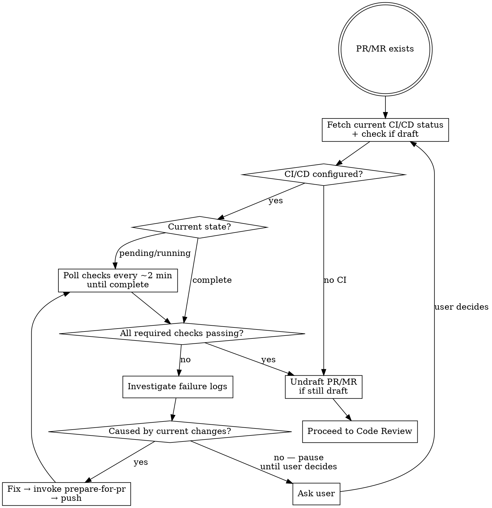
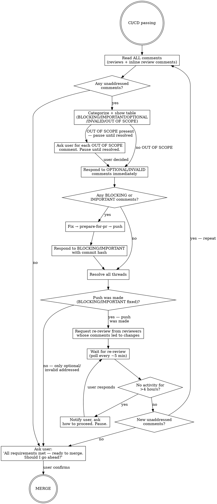

# PR Drive to Merge

## Overview

Takes an existing PR/MR and drives it to merge autonomously. Loops through CI/CD monitoring and code review cycles until all requirements are satisfied.

**Core principle:** Fix only what belongs to the current PR. Ask the user only when a problem is outside the current PR scope and the fix isn't obvious.

## Setup

Before starting, detect the PR and platform:

```bash
# GitHub — fetch all needed fields in one call
PR_INFO=$(gh pr view --json number,baseRefName,isDraft)
PR_NUMBER=$(echo "$PR_INFO" | jq -r .number)
BASE=$(echo "$PR_INFO" | jq -r .baseRefName)
IS_DRAFT=$(echo "$PR_INFO" | jq -r .isDraft)

# GitLab — detect MR number and base branch
MR_INFO=$(glab mr view --output json)
MR_NUMBER=$(echo "$MR_INFO" | jq .iid)
BASE=$(echo "$MR_INFO" | jq -r .target_branch)
IS_DRAFT=$(echo "$MR_INFO" | jq .draft)
```

**Platform detection:** check `git remote get-url origin`.
- Contains `github.com` (HTTPS: `https://github.com/...` or SSH: `git@github.com:...`) → use `gh`
- Contains `gitlab` → use `glab`

## Phase 1: CI/CD Monitoring



**Invoking `prepare-for-pr` for fixes:** invoke it as a sub-skill. It runs its own quality loop, commits fixes, and exits when clean. If it pauses for user input, this skill also pauses. After it exits, push: `git push`.

## Phase 2: Code Review Cycle



**Reading comments:** `gh pr view <N> --comments` does not return inline review comments. Fetch them separately:

```bash
# GitHub — inline review comments
gh api repos/{owner}/{repo}/pulls/{number}/comments

# GitLab — all discussions (includes inline)
glab api /projects/:fullpath/merge_requests/:iid/discussions
```

## Handling Unclear Feedback

Ask for clarification on ALL unclear items at once — not one at a time. **Example:**
```
Reviewer: "Fix 1-6"
You understand 1,2,3,6. Unclear on 4,5.

Wrong: Implement 1,2,3,6 now, ask about 4,5 later
Right: "I understand items 1,2,3,6. Need clarification on 4 and 5 before proceeding."
```

## Verifying Suggestions and Pushing Back

Before implementing any BLOCKING or IMPORTANT suggestion, verify it first:

```
1. Check: Technically correct for THIS codebase?
2. Check: Would it break existing functionality?
3. Check: Is there a reason the current code is written this way?
4. Check: Works on all platforms/versions targeted by this PR?
5. Check: Does the reviewer have full context?
```

**If any check fails — push back:**
- Use technical reasoning, not defensiveness
- Ask specific questions; reference working tests or existing code as evidence
- Involve the user if the disagreement is architectural
- State it factually in the response thread — no apology, no over-explaining

**If you can't easily verify:** say so — "I can't verify this without [X]. Should I [investigate/ask/proceed]?"

**If it conflicts with prior decisions for this PR:** discuss with user first.

**YAGNI check** — if a reviewer suggests "implementing it properly" or adding infrastructure: search codebase for actual usage. If unused: push back. If used: implement properly.

## Comment Categories

Assign ONE category per comment. Show full table before acting. Proceed without waiting for approval except for OUT OF SCOPE.

| Category | When to use | Action |
|----------|-------------|--------|
| **BLOCKING** | Security issues, critical bugs, compliance violations | Verify → Fix → respond → Resolve |
| **IMPORTANT** | Bugs, missing error handling, missing tests | Verify → Fix → respond → Resolve |
| **OPTIONAL** | Style, naming preference, refactoring suggestion, nitpick | Respond acknowledging → Resolve without fixing |
| **INVALID** | Already fixed, no longer applies | Respond acknowledging → Resolve |
| **INVALID (praise)** | Compliments, thanks | Resolve without responding |
| **OUT OF SCOPE** | Requires changes outside this PR | Ask user before acting |

**Show table format:**

```markdown
## PR Review Comments

| # | Author | Location | Summary | Category | Action |
|---|--------|----------|---------|----------|--------|
| 1 | @dev | auth.ts:23 | Password in plaintext | BLOCKING | Will fix |
| 2 | @dev | auth.ts:12 | Rename doAuth | OPTIONAL | Will acknowledge |
| 3 | @qa | auth.ts:45 | Missing error handling | IMPORTANT | Will fix |
| 4 | @dev | auth.ts:67 | Nice work! | INVALID | Will acknowledge |
| 5 | @dev | utils.ts:10 | Whole file needs refactor | OUT OF SCOPE | Need your input |

Proceeding with BLOCKING + IMPORTANT fixes. Waiting on your input for OUT OF SCOPE (#5).
```

## Responding to Comments

**Reply in the comment thread when possible.** For fixed comments: respond after pushing, referencing the commit hash. For all others: respond immediately.

```bash
# GitHub — reply to an inline review comment (omit pull number — it's not part of this endpoint)
gh api repos/{owner}/{repo}/pulls/comments/{comment_id}/replies \
  --method POST -f body="Your reply here"

# GitHub — reply to a review summary or top-level PR comment (not an inline thread)
gh pr comment $PR_NUMBER --body "Your reply here"
```

**No performative agreement.** Never write "You're absolutely right!", "Great point!", "Excellent feedback!", or thank the reviewer. Actions speak — just fix it and show what changed.

| Category | Response template |
|----------|------------------|
| BLOCKING/IMPORTANT (fixed) | `Fixed in [commit hash]. [What changed and why.]` |
| BLOCKING/IMPORTANT (pushed back, then verified correct) | `Checked [X] — confirmed it does [Y]. Fixed in [commit hash].` |
| BLOCKING/IMPORTANT (pushing back) | `[Technical reasoning]. [Evidence from codebase.] Leaving as-is.` |
| OPTIONAL | `Not addressing in this PR to keep it focused on [goal].` *(If genuinely useful: "Logged as [issue link] for follow-up.")* |
| INVALID (outdated) | `This was addressed in [commit]. [File/code] now [does X].` |
| INVALID (praise) | *(no response needed — just resolve)* |
| OUT OF SCOPE | Per user's instruction |

## Resolving Threads

After responding, resolve threads where the issue is closed. Do NOT resolve if discussion is ongoing or awaiting reviewer confirmation.

```bash
# GitHub — resolve review thread via GraphQL
# 1. Get thread node IDs:
gh api graphql -f query='
  query($owner:String!,$repo:String!,$number:Int!) {
    repository(owner:$owner,name:$repo) {
      pullRequest(number:$number) {
        reviewThreads(first:100) { nodes { id isResolved } }
      }
    }
  }
' -f owner=OWNER -f repo=REPO -F number=N

# 2. Resolve a thread:
gh api graphql -f query='
  mutation($id:ID!) { resolveReviewThread(input:{threadId:$id}) { thread { isResolved } } }
' -f id=THREAD_NODE_ID

# GitLab — resolve a discussion:
glab api /projects/:fullpath/merge_requests/:iid/discussions/:discussion_id \
  --method PUT -f resolved=true
```

## Re-Review

Request re-review only from reviewers whose BLOCKING or IMPORTANT comments led to actual changes. Do not re-request from reviewers who only left OPTIONAL or INVALID comments.

```bash
# GitHub — re-request review (use API, not --add-reviewer which only adds new reviewers)
REPO=$(gh repo view --json nameWithOwner -q .nameWithOwner)
gh api --method POST /repos/$REPO/pulls/$PR_NUMBER/requested_reviewers \
  -f "reviewers[]=username1" -f "reviewers[]=username2"

# GitLab — re-request review via API (glab mr update has no --reviewer flag)
FULLPATH=$(glab repo view --output json | jq -r '.nameWithNamespace | gsub(" "; "") | gsub("/"; "%2F")')
# Build reviewer_ids[] args for each username
REVIEWER_ARGS=()
for username in username1 username2; do
  id=$(glab api "/users?username=${username}" --jq '.[0].id')
  REVIEWER_ARGS+=(-f "reviewer_ids[]=${id}")
done
glab api /projects/$FULLPATH/merge_requests/$MR_NUMBER --method PUT "${REVIEWER_ARGS[@]}"
```

## Merge Requirements Checklist

Before merging, verify all of:
- [ ] All required CI/CD checks pass
- [ ] Required approvals received
- [ ] No unresolved blocking threads
- [ ] Branch up to date with base branch

When all boxes are checked, **stop and ask the user for confirmation**:

> All merge requirements are met — CI passing, approvals received, all threads resolved, branch up to date.
> Should I go ahead and merge?

Only merge after explicit confirmation. Exception: if the user already pre-approved the merge earlier in the conversation (e.g. "merge it when it's ready"), proceed without asking again.

**Branch behind base** — check after every push and before merging. If behind:
```bash
# GitHub
gh pr update-branch <PR_NUMBER>
# or: git fetch origin $BASE && git rebase origin/$BASE
# If rebase produces conflicts:
#   resolve manually → git add <resolved files> → git rebase --continue
#   if conflicts touch files outside this PR scope → ask user before proceeding
git push --force-with-lease

# GitLab
glab mr rebase <MR_NUMBER>
# If conflict: resolve manually, then git push --force-with-lease
```

## Tools Priority

Prefer **CLI → REST API → MCP** in that order. Platform detection is covered in Setup.
