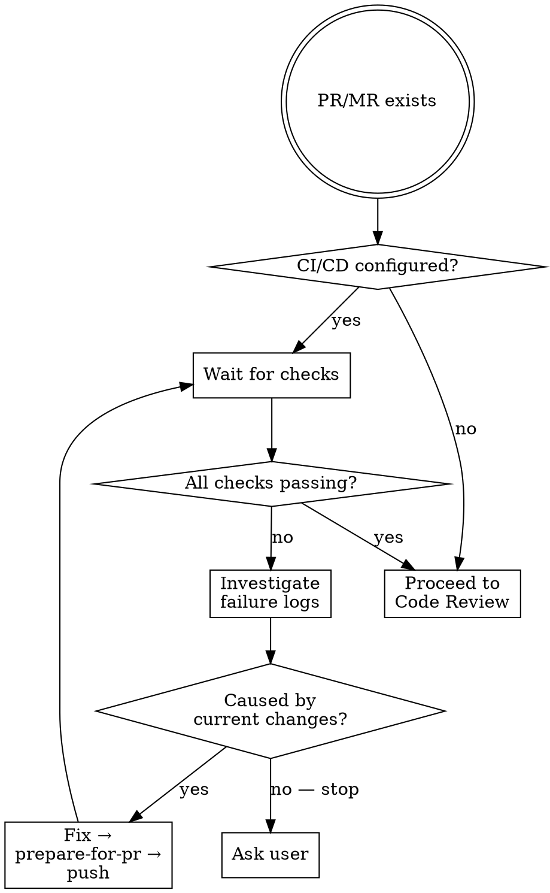
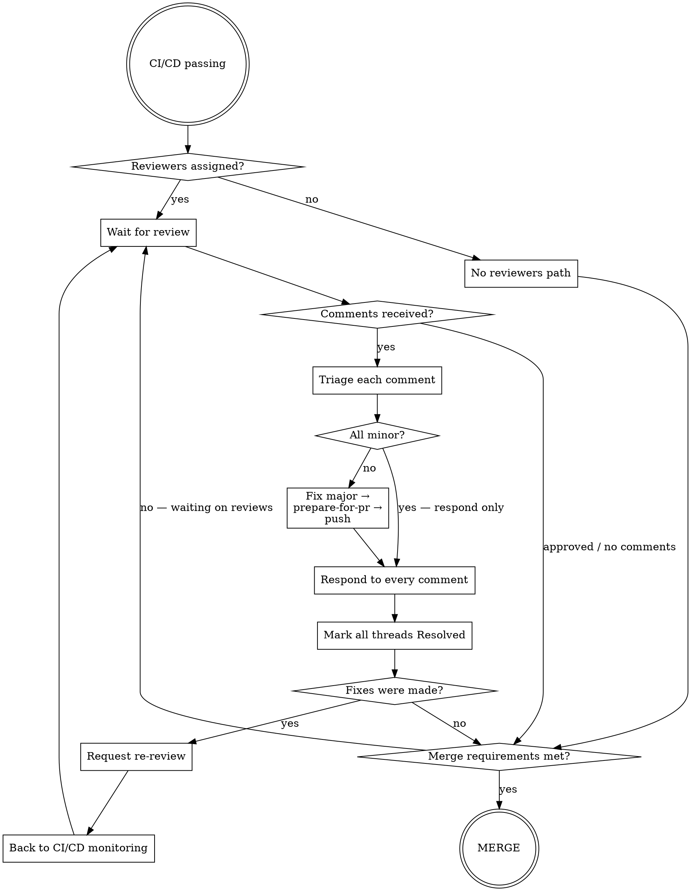

# PR Lifecycle

## Overview

Takes an existing PR/MR and drives it to merge autonomously. Loops through CI/CD monitoring and code review cycles until all requirements are satisfied.

**Core principle:** Fix only what belongs to the current PR. If a failure or comment is caused by something outside the current scope and the fix isn't obvious — ask the user.

## Phase 1: CI/CD Monitoring

## Phase 2: Code Review Cycle

## Comment Triage Rules

Classify each comment autonomously. Respond individually to every comment — never a single summary response.

| Type | Criteria | Action |
|------|----------|--------|
| **Major** | Bug, incorrect behavior, security issue, design flaw | Fix → respond with explanation → Resolve |
| **Minor** | Style, naming preference, optional refactor, nitpick | Respond acknowledging → Resolve without fixing |
| **Question** | Needs clarification | Answer fully → Resolve |
| **Out of scope** | Requires changes outside this PR's scope, fix not obvious | Ask user before acting |

**Always respond in the same language as the PR and review comments.**

See `responding-to-pr-comments` for response templates and resolve mechanics.

## Merge Requirements Checklist

Before merging, confirm all of:
- [ ] All required CI/CD checks pass
- [ ] Required approvals received (or no reviewers assigned)
- [ ] No unresolved blocking threads
- [ ] Branch is up to date with base branch

## When to Ask the User

Ask only when:
- CI/CD failure is caused by something outside the current PR
- A reviewer comment requires changes outside the current PR scope and the right fix isn't obvious
- Merge is blocked for a reason unrelated to the PR changes

Don't ask for minor/major comment classification, standard fixes, or routine re-review requests.
