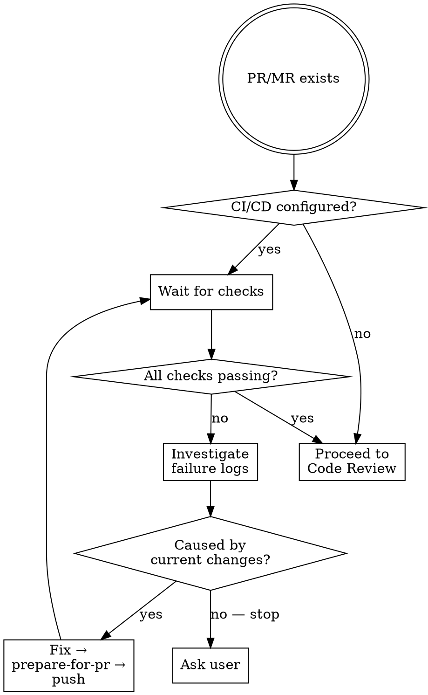
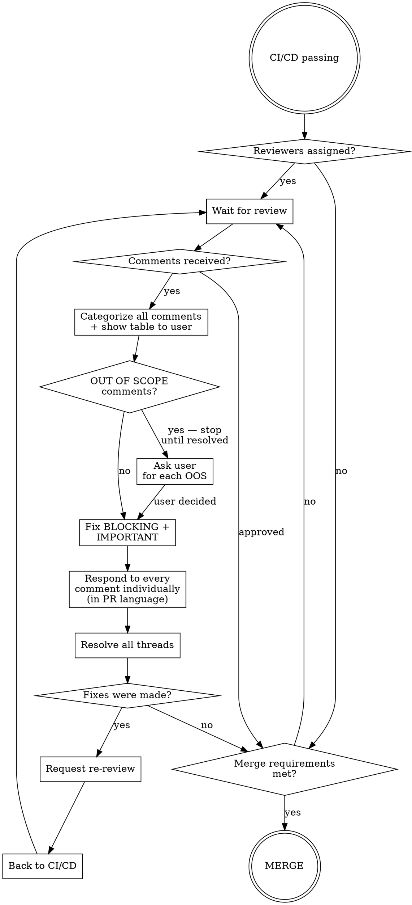

# PR Lifecycle

## Overview

Takes an existing PR/MR and drives it to merge autonomously. Loops through CI/CD monitoring and code review cycles until all requirements are satisfied.

**Core principle:** Fix only what belongs to the current PR. Ask the user when a problem is outside the current scope and the fix isn't obvious.

## Phase 1: CI/CD Monitoring



## Phase 2: Code Review Cycle



## Comment Categories

Assign ONE category per comment. Show the full table to user before acting — then proceed without waiting for approval, except for OUT OF SCOPE.

| Category | When to use | Action |
|----------|-------------|--------|
| **BLOCKING** | Security issues, critical bugs, compliance violations | Fix → respond with explanation → Resolve |
| **IMPORTANT** | Bugs, missing error handling, missing tests | Fix → respond with explanation → Resolve |
| **OPTIONAL** | Style, naming preference, refactor suggestions, nitpicks | Respond acknowledging → Resolve without fixing |
| **INVALID** | Already fixed, no longer applies, praise | Respond acknowledging → Resolve |
| **OUT OF SCOPE** | Requires changes outside this PR's scope | Ask user before acting |

**Show before acting:**

```markdown
## PR Review Comments

| # | Author | Location | Comment | Category | Action |
|---|--------|----------|---------|----------|--------|
| 1 | @dev | auth.ts:23 | "Password in plaintext" | BLOCKING | Will fix |
| 2 | @dev | auth.ts:12 | "Rename doAuth" | OPTIONAL | Will acknowledge |
| 3 | @qa | auth.ts:45 | "Missing error handling" | IMPORTANT | Will fix |
| 4 | @dev | auth.ts:67 | "Nice work!" | INVALID | Will acknowledge |
| 5 | @dev | utils.ts:10 | "This whole file needs refactor" | OUT OF SCOPE | Need your input |

Proceeding with BLOCKING + IMPORTANT fixes. OUT OF SCOPE items need your decision first.
```

## Responding to Comments

**Always respond in the same language as the PR and review comments.**

Respond to **every** comment individually — never a single summary.

| Category | Response template |
|----------|------------------|
| BLOCKING/IMPORTANT (fixed) | `✅ Fixed in [commit]. [What changed and why.]` |
| OPTIONAL (deferred) | `Good suggestion. Deferring to keep this PR focused — created [issue] to track.` |
| INVALID (outdated) | `This was addressed in [commit]. [File/code] now [does X].` |
| INVALID (praise) | `Thank you!` |
| OUT OF SCOPE (after user decision) | Per user's instruction |

## Resolving Threads

After responding, mark as Resolved if:
- Fix was implemented
- Question was answered
- Comment no longer applies

Do NOT resolve if discussion is ongoing or waiting for reviewer confirmation.

Use GitHub web UI for resolving ("Resolve conversation" button) — `gh` CLI doesn't support it directly.

## Re-Review

Request re-review only from reviewers whose BLOCKING or IMPORTANT comments were fixed:

```bash
gh pr edit <PR_NUMBER> --add-reviewer @username1,@username2
```

Do not request re-review for OPTIONAL deferred items or INVALID comments.

## Merge Requirements Checklist

- [ ] All required CI/CD checks pass
- [ ] Required approvals received (or no reviewers)
- [ ] No unresolved blocking threads
- [ ] Branch up to date with base branch

## Tools Priority

**gh CLI → REST API → GitHub MCP**

```bash
gh pr view <PR_NUMBER> --comments   # read comments
gh pr comment <PR_NUMBER> --body "…" # reply
gh pr edit <PR_NUMBER> --add-reviewer @user  # re-review
```
