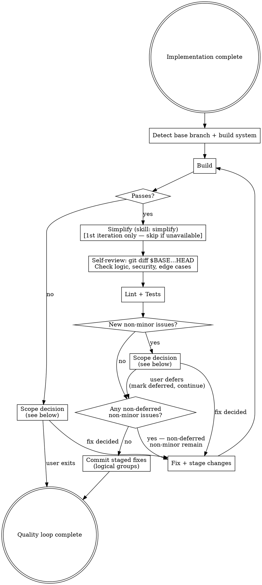
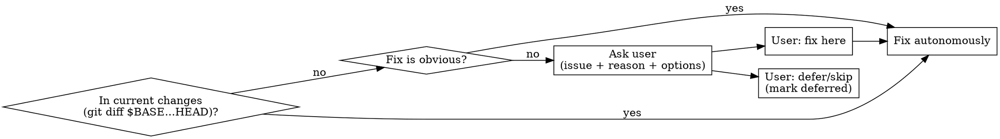

# Prepare for PR

## Overview

Runs a quality loop over the current branch changes until the code is clean enough to expose in a PR.

**Core principle:** Fix only what belongs to current changes. Out-of-scope issues with an obvious fix can be handled autonomously; otherwise ask the user.

## Setup

Before the loop, establish the diff base and build tooling:

```bash
# Determine base branch
BASE=$(git remote show origin 2>/dev/null | grep "HEAD branch" | awk '{print $NF}')
# Fallback: try main → master → develop

# Current changes boundary (use throughout for scope decisions)
git diff $BASE...HEAD
```

**Build system detection — use highest-priority match when multiple files present:**

| Priority | File present | Build | Lint | Test |
|----------|---|---|---|---|
| 1 | `Makefile` (with build/lint/test targets) | `make build` | `make lint` | `make test` |
| 2 | `package.json` | `npm run build` | `npm run lint` | `npm test` |
| 3 | `Cargo.toml` | `cargo build` | `cargo clippy` | `cargo test` |
| 4 | `build.gradle(.kts)` | `./gradlew build` | `./gradlew lint` | `./gradlew test` |
| 5 | `pom.xml` | `mvn package -q` | `mvn checkstyle:check` | `mvn test` |
| 6 | `go.mod` | `go build ./...` | `golangci-lint run` | `go test ./...` |
| 7 | `pyproject.toml` / `setup.py` | `pip install -e .` | `ruff check .` | `pytest` |

## Quality Loop

**Track all issues found and their status (open / fixed / deferred) across iterations.** On re-entry, only report NEW issues. Deferred issues are removed from the fix queue — never re-prompted.

**Stage and commit fixes as you make them** during the loop, grouping related changes together (use specific file paths, not `git add .`). This allows logical commit grouping without having to reconstruct it at the end.

**Simplify runs only on the first iteration.** Self-review and lint/tests run every iteration.



## Scope Decision



**In scope — fix autonomously:** bugs introduced by current changes, tests broken by current changes, lint errors in changed files, logic/security errors in current implementation.

**Out of scope, obvious fix:** missing import clearly needed by new code, typo in a newly added string, test fixture update required by a changed function signature.

**Out of scope, ask user:** pre-existing failures in untouched files, build errors from unrelated dependency changes, failures in files not touched by this branch. When asking, include: what the issue is, why it appears unrelated, and options (fix here / skip / open separate issue). Pause until user responds.

## Self-Review Criteria

Run `git diff $BASE...HEAD` and check for:
- Logic errors or off-by-one mistakes
- Missing error handling for new code paths
- Security issues (exposed secrets, injection risks, missing validation)
- Missing or insufficient tests for new behavior
- Dead code or unreachable branches introduced

## What "Minor" Means

**Minor (exit loop):** style preferences, optional naming improvements, cosmetic suggestions with no correctness impact.

**Non-minor (keep looping):** bugs, broken tests, lint errors, security issues, incorrect logic, missing required tests.

## Output

```markdown
## Quality Loop Result

| Step | Issues found | Fixed | Deferred |
|------|-------------|-------|---------|
| Build | ... | ... | ... |
| Simplify | ... | ... | — |
| Self-review | ... | ... | ... |
| Lint + Tests | ... | ... | ... |

**Quality loop complete.** [If deferred items exist: X items deferred — see above.]
```
