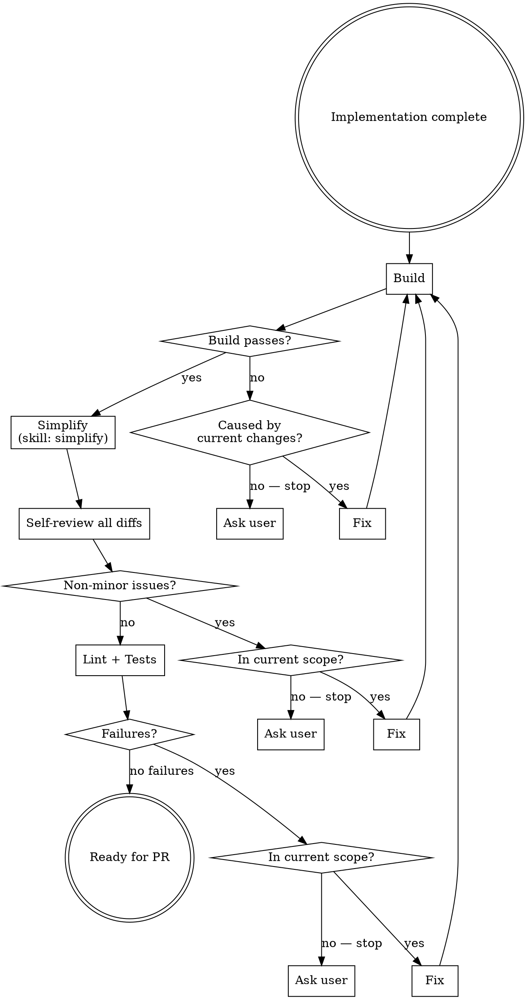

# Prepare for PR

## Overview

Runs a quality loop over the current branch changes until the code is clean enough to expose in a PR.

**Core principle:** Fix only what belongs to the current changes. If a problem is caused by something outside the current scope and the fix isn't obvious — ask the user.

## Quality Loop

Repeat until only minor issues remain or none at all. Record issues found at each step before fixing.

## Scope Decision

**In scope — fix autonomously:**
- Bugs introduced by current changes
- Tests broken by current changes
- Lint errors in changed files
- Logic errors in current implementation

**Out of scope — ask user only if fix isn't obvious:**
- Pre-existing failures unrelated to this PR
- Test failures in files not touched
- Build errors from dependency issues or unrelated commits

When asking, include: what the issue is, why it seems unrelated, and options (fix here / ignore / open separate issue).

## What "Minor" Means

**Minor (exit loop — code is ready):** style preferences, optional naming, cosmetic suggestions with no correctness impact.

**Non-minor (keep looping):** bugs, broken tests, lint errors, security issues, incorrect logic.

## Output

When the loop exits, report:
- Issues found per step and what was fixed
- Any items escalated to user
- Confirmation: **"Code is ready for PR"**
