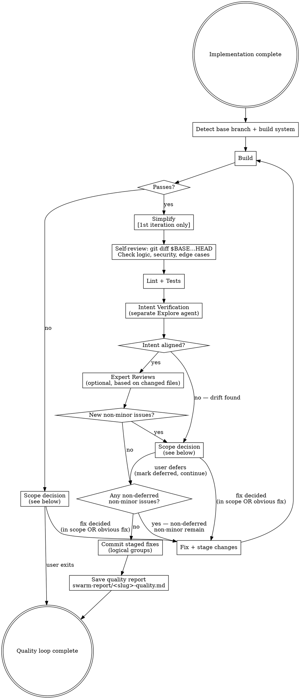
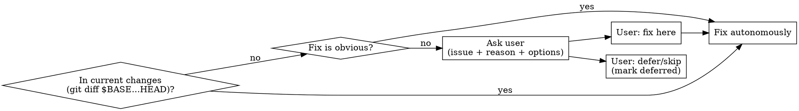

# Prepare for PR

## Overview

Runs a quality loop over the current branch changes until the code is clean enough to expose in a PR.

**Core principle:** Fix only what belongs to current changes. Out-of-scope issues with an obvious fix can be handled autonomously; otherwise ask the user.

## Iteration Limits

- **Per gate:** if a single gate (build, lint, self-review, etc.) fails 3 consecutive fix attempts, stop fixing and escalate to the user with a summary of what was tried.
- **Total loop:** maximum 5 full loop iterations. If issues persist after 5 iterations, stop and produce the quality report with status `partial` — further iteration is unlikely to converge.

## Setup

Before the loop, establish the diff base and build tooling:

```bash
# Determine base branch
BASE=$(git remote show origin 2>/dev/null | grep "HEAD branch" | awk '{print $NF}')
# Fallback: try main → master → develop

# Current changes boundary (use throughout for scope decisions)
git diff $BASE...HEAD
```

**Build system detection — use highest-priority match when multiple files present:**

| Priority | File present | Build | Lint | Test |
|----------|---|---|---|---|
| 1 | `Makefile` (with build/lint/test targets) | `make build` | `make lint` | `make test` |
| 2 | `package.json` | `npm run build` | `npm run lint` | `npm test` |
| 3 | `Cargo.toml` | `cargo build` | `cargo clippy` | `cargo test` |
| 4 | `build.gradle(.kts)` | `./gradlew build` | `./gradlew lint` | `./gradlew test` |
| 5 | `pom.xml` | `mvn package -q` | `mvn checkstyle:check` | `mvn test` |
| 6 | `go.mod` | `go build ./...` | `golangci-lint run` | `go test ./...` |
| 7 | `pyproject.toml` / `setup.py` | `pip install -e .` | `ruff check .` | `pytest` |

**Monorepo / subdirectory projects:** if all changed files are under a single subdirectory that has its own build file, prefer that subdirectory's build system over the root. Example: all changes under `plugins/maven-mcp/` which has its own `package.json` → run `npm` commands from that subdirectory, not a root `Makefile`.

## Quality Loop

**Track all issues found and their status (open / fixed / deferred) across iterations.** On re-entry, only report NEW issues. Deferred issues are removed from the fix queue — never re-prompted.

**Stage and commit fixes as you make them** during the loop, grouping related changes together (use specific file paths, not `git add .`). This allows logical commit grouping without having to reconstruct it at the end.

**Simplify runs only on the first iteration.** Self-review and lint/tests run every iteration.



## Scope Decision



**In scope — fix autonomously:** bugs introduced by current changes, tests broken by current changes, lint errors in changed files, logic/security errors in current implementation.

**Out of scope, obvious fix:** missing import clearly needed by new code, typo in a newly added string, test fixture update required by a changed function signature.

**Out of scope, ask user:** pre-existing failures in untouched files, build errors from unrelated dependency changes, failures in files not touched by this branch. When asking, include: what the issue is, why it appears unrelated, and options (fix here / skip / open separate issue). Pause until user responds.

## Simplify

Review all changed code (`git diff $BASE...HEAD`) for unnecessary complexity, duplication, and unclear naming. Simplify where possible without changing behavior:
- Remove dead code, unused imports, unreachable branches introduced by current changes
- Extract duplicated logic into shared functions
- Simplify overly nested conditionals or verbose patterns
- Rename unclear variables/functions to express intent
- Replace manual implementations with standard library equivalents where obvious

Fix issues inline, stage and commit. If no simplification opportunities — proceed to self-review.

## Self-Review Criteria

Run `git diff $BASE...HEAD` and check for:
- Logic errors or off-by-one mistakes
- Missing error handling for new code paths
- Security issues (exposed secrets, injection risks, missing validation)
- Missing or insufficient tests for new behavior
- Dead code or unreachable branches introduced

## Intent Verification

**Runs after lint/tests pass.** This is a semantic self-review that checks whether the code actually solves the stated problem — not just whether it compiles and passes tests.

**This review MUST be done by a DIFFERENT agent** than the one that wrote the code. Launch a fresh Explore agent for this step. The implementor reviewing their own work has blind spots — a separate agent catches intent drift, scope creep, and missed acceptance criteria.

### Procedure

The Explore agent receives this prompt:

```
You are performing an intent verification review. Your job is to compare what was
ASKED for against what was BUILT — checking for alignment, scope creep, and
completeness.

## Original Task
{task description from conversation context or swarm-report/<slug>-plan.md}

## Changes
{output of: git diff $BASE...HEAD}

## Checks

Answer each question with PASS, WARN, or FAIL and a 1-2 sentence explanation:

1. **Solves the stated problem?** — Does the code address the core ask?
2. **Scope creep?** — Are there changes unrelated to the task? List any files or
   functions that seem outside the original scope.
3. **Acceptance criteria met?** — If the plan has acceptance criteria, check each
   one. If no explicit criteria, assess whether reasonable implicit criteria are met.
4. **Intent drift?** — Has the approach diverged from what was planned? Is the
   divergence justified (e.g., discovered a better approach) or accidental?
5. **Missing pieces?** — Is anything from the task description NOT addressed in
   the code?

## Output

### Verdict: {PASS | WARN | FAIL}

### Details
{Answers to each check above}

### Issues (if WARN or FAIL)
- {issue description} — {suggestion}
```

### Handling the Result

- **PASS** — proceed to expert reviews (if applicable) or finish.
- **WARN** — present warnings to the user. If warnings are about scope creep, ask whether to revert or keep. If about missing pieces, fix them.
- **FAIL** — treat as non-minor issues. Enter the fix cycle. After fixing, re-run intent verification (counts toward the per-gate 3-attempt limit).

### Locating the Task Description

Check these sources in order:
1. `swarm-report/<slug>-plan.md` — if a plan exists, use its goal and acceptance criteria
2. Conversation context — the original user request
3. PR description (if a draft PR exists) — `gh pr view --json body`
4. If none found — skip intent verification and log a warning in the quality report

## Expert Reviews (Optional)

After intent verification passes, optionally trigger parallel expert reviews based on what files changed. These are NOT mandatory for every PR — only when changes touch areas that benefit from specialist attention.

### Trigger Rules

Analyze the diff (`git diff $BASE...HEAD --name-only` and content) to determine which experts to invoke:

| Expert | Trigger condition |
|--------|-------------------|
| `security-expert` | Changes touch: auth/login/session logic, crypto/hashing, token handling, network/API calls, user data processing, permission checks, input validation, secrets/env files |
| `performance-expert` | Changes touch: list/collection processing (RecyclerView, LazyColumn, large loops), DB queries/Room/SQLDelight, image loading/caching, hot paths (called per-frame or per-item), serialization/deserialization of large payloads |
| `architecture-expert` | Changes: add new modules/packages, modify dependency direction between layers, change public API surfaces (new public classes/interfaces), introduce new architectural patterns |

**If no triggers match — skip expert reviews entirely.** Most single-file bugfixes and small changes need no expert review.

### Expert Review Prompt

Each expert receives:

```
You are reviewing code changes as a {expert_role} expert.

## Changes
{git diff $BASE...HEAD — filtered to relevant files if possible}

## Focus
Review ONLY from your area of expertise. Do not comment on general code quality,
naming, or style — other steps handle that.

## Output Format
### Issues
For each issue:
**Issue N: {title}**
- **severity**: critical | major | minor
- **issue**: {description}
- **suggestion**: {fix}

If no issues found in your domain, respond with:
### No issues found
{1 sentence confirming what you checked}
```

### Handling Expert Results

- **Critical issues** — treat as non-minor, enter fix cycle
- **Major issues** — present to user, fix if in scope
- **Minor issues** — include in quality report as suggestions, do not block
- **No issues** — note in quality report that expert review passed

Experts run in parallel. Wait for all to complete before proceeding.

## Quality Report

At the end of the quality loop (whether exiting clean or hitting the iteration cap), save a summary to `swarm-report/<slug>-quality.md`:

```markdown
# Quality Report: {slug}

**Branch:** {branch name}
**Base:** {base branch}
**Status:** {clean | partial | escalated}
**Iterations:** {N} of 5

## Gate Results

| Gate | Result | Issues Found | Fixed | Deferred |
|------|--------|-------------|-------|----------|
| Build | PASS/FAIL | ... | ... | ... |
| Simplify | PASS/SKIP | ... | ... | — |
| Self-review | PASS/WARN | ... | ... | ... |
| Lint + Tests | PASS/FAIL | ... | ... | ... |
| Intent Verification | PASS/WARN/FAIL/SKIP | ... | ... | ... |
| Expert: security | PASS/SKIP/N-issues | ... | ... | ... |
| Expert: performance | PASS/SKIP/N-issues | ... | ... | ... |
| Expert: architecture | PASS/SKIP/N-issues | ... | ... | ... |

## Deferred Issues
{list of deferred issues with reasons, or "None"}

## Suggestions
{minor issues and expert suggestions not blocking the PR}
```

The quality report artifact serves as the receipt for the Quality stage in the dev-workflow state machine (see `dev-workflow-orchestration.md`).

## What "Minor" Means

**Minor (exit loop):** style preferences, optional naming improvements, cosmetic suggestions with no correctness impact.

**Non-minor (keep looping):** bugs, broken tests, lint errors, security issues, incorrect logic, missing required tests.

## Output

Display a summary to the user and save the full quality report artifact:

```markdown
## Quality Loop Result

| Step | Issues found | Fixed | Deferred |
|------|-------------|-------|---------|
| Build | ... | ... | ... |
| Simplify | ... | ... | — |
| Self-review | ... | ... | ... |
| Lint + Tests | ... | ... | ... |
| Intent Verification | ... | ... | ... |
| Expert Reviews | ... | ... | ... |

**Quality loop complete.** [If deferred items exist: X items deferred — see above.]
```

Full quality report saved to `swarm-report/<slug>-quality.md` (see Quality Report section above).
