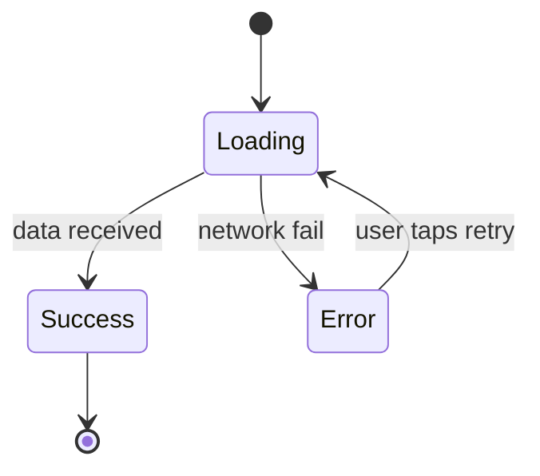

# Spec Template

Full template for `docs/spec/<slug>.md`. Section order is fixed — a reimplementer scans
specs in the same order for comparable features, so consistency across specs matters.

Sections that are genuinely not applicable for a given feature are kept as `N/A —
<one-line reason>`. Never delete a section; an empty section reads as oversight.

## Reading order

The spec is organised in four parts so that different readers can stop where they have
what they need:

- **Part A (§§1-7) — Product behavior.** What the feature does for the user. A PM /
  designer can read this and stop — they have the full product-facing picture.
- **Part B (§§8-9) — Product decisions & risks.** Open questions (unresolved intent)
  and known defects (bugs not to reproduce). Also product-facing — these are the
  decisions the team still owes the feature.
- **Part C (§§10-12) — Technical integration.** How the feature connects to the rest
  of the system: endpoints, storage, platform, collaborators, load-bearing tech. A
  dev-reimplementer reads this as the bridge between product intent and engineering
  choices.
- **Part D (§13) — Appendix.** Code map — `path:line` pointers for those who are
  actually modifying the current code. Safe to skip for anyone reimplementing on a
  different stack.

**Language rules for the body (Sections 1–8, 10–11):**

- Zero code identifiers. No class names, method names, type names, sealed-class cases,
  enum values, field names, file paths, reactive-primitive names, async-primitive
  names, or framework idioms. See `behavior-translation.md` for recipes.
- Keep technology references only when load-bearing (§12 only) — see
  `tech-abstraction.md`.
- Preserve verbatim: user-visible copy (quoted), exact numbers, URL patterns, external
  event/field names, RFC/protocol references.
- Sanity test for each sentence: *if every symbol in the codebase were renamed
  tomorrow, would this sentence still describe the same feature?* If not, rewrite.

---

## Template

```markdown
# <Feature name>

> Status: <Draft | Approved>
> Source: reverse-engineered from code at <commit-sha or date>
> Owner: <if known, else "unknown">
> Language: <ru | en | ...>

<!-- ============================================================ -->
<!-- Part A — Product behavior (§§1-7)                              -->
<!-- ============================================================ -->

## 1. Overview

One or two paragraphs. What the feature is. Who uses it. What problem it solves. Why it
exists. If business context is unknown, write "business context: unknown — see Open
Questions" rather than inventing one.

Also list in one line:
- **Primary user:** <role / segment>
- **Trigger:** <how a user reaches this feature — navigation, notification, deep link,
  automatic>
- **Primary outcome:** <what the user takes away when the flow succeeds>

## 2. User-facing behavior

Describe the feature as a sequence of observable interactions. Each step:
- **Action:** what the user does (or what triggers the system)
- **System response:** what the user observes
- **Exact copy:** verbatim text shown, quoted
- **Exact values:** timeouts, counts, thresholds — numeric

Cover the happy path first, then every meaningful branch. Group by flow if the feature
has several distinct flows (e.g. first-time vs returning user).

Describe operations by *purpose*, not by function signature. "Sign in" and "refresh
tokens" are operations; `OAuthClient.authorize()` and `OAuthClient.refresh()` are code.
If the finding in the state file names a method, rewrite it as an operation with a
stated outcome before it enters this section.

### 2.1 Happy path
<numbered steps>

### 2.2 Alternative flows
<by branch — name each>

### 2.3 Interruptions & resumption
What happens if the user backgrounds the app mid-flow, loses connectivity, receives an
incoming call, rotates the device, or the OS kills the process. If the feature has no
special handling, state that explicitly. This is the single home for interruption
behavior — §5.3 covers back-stack preservation, not process death.

## 3. UI description

Tech-agnostic description of layout and components. Describe the *role* of each
element, not its implementation. Allowed vocabulary: *primary action button*, *list*,
*modal*, *input field*, *secondary link*, *toolbar*, *bottom sheet*, *spinner*,
*avatar*. Forbidden vocabulary: `Button`, `LazyColumn`, `Box`, `Scaffold`, `UITableView`,
`<Dialog>`, `Composable`, `Fragment`, `View`, `MaterialCard`, any component library name.

For each screen / surface:
- **Layout:** top-to-bottom or visual structure in prose; a labelled ASCII sketch is
  welcome when it clarifies
- **Components:** list with role and behavior ("primary action button labelled 'Confirm';
  disabled until all required fields valid")
- **Interactive states:** default, hover/focus, pressed, disabled, loading
- **Transitions:** what animates, how, and why (if product-meaningful)

If a design source (Figma, screenshots) is available, link it here and note that the
design source is authoritative for pixel-level details. The spec carries behavior and
copy; the design source carries visuals.

## 4. States

Table or list of states, each with:
- **Name** — a business name for the state ("not authenticated", "authorizing",
  "token-expired", "offline-cached"). Not the code name of the sealed-class case.
- **Trigger:** when this state appears
- **What the user sees:** copy, component roles, actions available
- **Exit transitions:** how the user leaves this state

At minimum cover these (mark N/A if truly not applicable):
- loading
- empty
- error (with per-error-class breakdown if meaningful)
- offline / no connectivity
- permission-denied (per permission required)
- degraded / partial (third-party unavailable, feature flag off, etc.)

If the feature has a non-trivial state machine (5+ states or non-linear transitions),
include a mermaid state diagram here:



Every edge in the diagram must correspond to a real transition. If an edge is
unreachable or only theoretical, do not draw it — unreachable edges break trust in
the diagram as a whole. For simpler flows, skip the diagram — prose transitions are
enough.

## 5. Navigation

### 5.1 Entry points

Table form is preferred — it scans faster and is easier to keep complete than prose.

| Type | Trigger | Parameters | Resulting state |
| --- | --- | --- | --- |
| Deep link | `app://payment/confirm?orderId=…` | `orderId` (required) | Confirm screen, order preloaded |
| Notification tap | topic `payment.required` | payload `orderId` | Same as above |
| In-app navigation | "Checkout" button on CartScreen | current cart via nav arg | Confirm screen with cart data |
| Deferred deep link | install-referrer `promo=X` | promo code | Confirm screen with promo applied |

Columns:
- **Type** — deep link, in-app navigation, notification, widget, deferred link, API
  callback, etc.
- **Trigger** — the exact URL, route name, event name, or UI action
- **Parameters** — what is passed in; mark required vs optional
- **Resulting state** — which screen / state the user lands on

### 5.2 Exit routes

Every way the user leaves the feature (completion, cancellation, error exit, deep
linking out). Note whether the exit is terminal (cannot return) or back-navigable.

### 5.3 State preservation

What is preserved on back navigation. What is reset on logout, on deep-link re-entry,
on switching accounts. Process-death behavior lives in §2.3 (Interruptions &
resumption), not here — §5.3 is about back-stack and explicit navigation.

## 6. Localization & accessibility

### 6.1 Localization
- languages supported by this feature
- strings that are hard-coded vs localized
- dynamic content (numbers, dates, currency) and how it is formatted
- any RTL considerations

If localization follows a project-wide convention, reference it and list only
feature-specific deviations.

### 6.2 Accessibility
- content descriptions / accessibility labels for interactive elements
- dynamic type / text scaling support
- color contrast considerations
- screen-reader flow if non-trivial

If the feature has no accessibility handling and the project has none either, state
that explicitly. Silent omission is not acceptable.

## 7. Analytics & logging

### 7.1 Events
Each user-visible action that sends an analytics event:
- event name (verbatim)
- trigger
- properties attached
- analytics destination (if several)

If the project has an analytics taxonomy doc, cross-reference it.

### 7.2 Logging
Log statements that carry product meaning (state transitions, failures, key decisions).
Routine debug logs are not spec-level.

<!-- ============================================================ -->
<!-- Part B — Product decisions & risks (§§8-9)                     -->
<!-- ============================================================ -->

## 8. Open questions

Questions raised during reverse-engineering that the code could not answer and the user
could not (yet) resolve. Each entry is tagged `[OQ-N]` so body sections can cross-reference
back.

- **[OQ-N] Question:** one-liner
- **Why it matters:** what decision depends on it
- **Current assumption:** what the spec currently implies (so the consequence of being
  wrong is explicit)

Body sections that depend on an open answer must include the `[OQ-N]` marker inline at
the relevant sentence, so a reader of §2, §4, or §10 immediately sees which claims are
contested. Bidirectional cross-reference: every `[OQ-N]` in the body has an entry here;
every entry here is referenced at least once in the body unless the question is
purely a follow-up without body impact.

Keep this section alive. When a question is resolved, move the answer into the
relevant body section, delete the `[OQ-N]` markers from the body, and remove the
entry here.

## 9. Known defects in current implementation (do not reproduce)

Dedicated section for **confirmed bugs** — places where the current code does something
that is clearly wrong, not something whose intent is unclear. A reimplementation must
**not** reproduce these. The spec body above describes the feature as it is *intended*
to work; this section flags where the current code deviates from that intent.

Each entry has four fields:

- **What** — one-line description of the observable defect.
- **Class** — one of: `crash`, `unreachable code`, `security weakness`, `dead link`,
  `localization gap`, `data loss`, `race condition`, `other` (name it).
- **Evidence** — `path:line` pointer plus short quote / scenario showing the defect.
- **Consequence** — what the user would observe or what risk this creates.

Do not put ambiguous findings here. If you are not certain it is a defect (e.g., a
retry count of 3 with unclear rationale), it belongs in §8 Open Questions, not here.
Pass 2 of coverage verification requires every §9 entry to have direct evidence plus
a stated reason it counts as a defect; speculation and "this looks wrong" do not
survive that gate.

When §9 has no entries, write `N/A — no confirmed defects identified.` The absence
of the section reads as oversight; explicit `N/A` is the correct signal.

### Example entries

| What | Class | Evidence | Consequence |
| --- | --- | --- | --- |
| Sign-in tap crashes on first use | crash | `AuthKoin.kt:12-18` defines the use-case module but no call site loads it — grepped `InitKoin`, `AppModule`, all `platformKoinModule.*.kt` | Tapping the primary action on the sign-in screen throws `NoBeanDefFoundException` and the app crashes |
| Sign-up link does nothing | dead link | `DefaultAuthComponent.kt:32` opens `https://accounts.frame.io/welcome` via `deepLinkProcessor.open(...)`; no matcher is registered for that URL | The secondary link silently no-ops when tapped |
| Non-cryptographic randomness used for PKCE state | security weakness | `PKCEGenerator.kt:14` uses `kotlin.random.Random`, not `SecureRandom` / `Security.randomBytes` | Predictable CSRF `state` weakens OAuth protection against cross-site request forgery |

<!-- ============================================================ -->
<!-- Part C — Technical integration (§§10-12)                       -->
<!-- ============================================================ -->

## 10. Data & integrations

### 10.1 Network operations

If the feature talks to the network — to any external service, to the backend, to an
identity provider, to a third-party API — list every endpoint here **as a single
consolidated table**, before anything else in §10. A reviewer asking "what endpoints
does this feature hit and why" should find the complete answer in one place.

One row per logical operation. A single endpoint called in multiple distinct contexts
(e.g., initial token exchange vs refresh) gets one row per context — the *trigger* is
part of the identity.

| Operation | Method | Endpoint | Auth | Triggered when | Key request fields | Key response fields |
| --- | --- | --- | --- | --- | --- | --- |
| Authorize (browser) | GET | `https://{idp-host}/authorize` | none | User taps Sign in | `client_id`, `redirect_uri`, `response_type=code`, `scope`, `state`, `code_challenge`, `code_challenge_method=S256` | (user-agent redirect to `redirect_uri?code=…&state=…`) |
| Exchange code for tokens | POST | `https://{idp-host}/token` | none (public client) | After redirect with `code` | `grant_type=authorization_code`, `code`, `redirect_uri`, `client_id`, `code_verifier` | `access_token`, `refresh_token?`, `token_type`, `expires_in`, `scope?` |
| Refresh tokens | POST | `https://{idp-host}/token` | none | Access token within 60 s of expiry, or host requests refresh | `grant_type=refresh_token`, `refresh_token`, `client_id` | same shape as exchange |
| Fetch current user | GET | `https://{api-host}/v4/users/me` | `Authorization: Bearer {access_token}` | Immediately after a successful token exchange | — | `id` (used); other fields ignored |

Column rules:

- **Operation** — short business name (not the code method that calls it).
- **Method** — HTTP verb; `WS` / `SSE` / `GQL` acceptable for non-REST protocols.
- **Endpoint** — URL pattern with path parameters in `{braces}`. Host placeholders
  (`{idp-host}`, `{api-host}`) expand via §10.5 External services — which pins each
  host to a concrete provider (or lists the fallbacks).
- **Auth** — `none`, `Bearer`, `Basic`, custom header name, or reference to the spec
  section that defines the scheme.
- **Triggered when** — the user action or state transition that fires the call. If
  triggered by a background timer / lifecycle event, say so.
- **Key request / response fields** — only fields the feature actually reads or sends.
  Full wire contracts live in §10.6 Data contracts. Use *wire* names, never code
  names.

If the feature does not talk to the network: `N/A — this feature runs entirely offline
within the app.` Explicit N/A, not an omitted subsection.

### 10.2 Local persistence

What the feature reads and writes to local storage.

- Reads: key or identifier, trigger (startup, on-demand, lifecycle event), what the
  data represents.
- Writes: key or identifier, trigger, contents (by role, not by code shape),
  invalidation rule (on logout, on expiry, on user action).

### 10.3 Platform events and push

- Platform events consumed (deep-link intents, app-lifecycle callbacks, OS-delivered
  push payloads) — topic / URL pattern / event name as delivered by the platform.
- Platform-level side effects the feature triggers (system toasts, haptics, audio,
  clipboard writes, notifications, system vibration) — user-visible ones.
- Feature-to-feature events (in-app event bus, cross-module signals) — name + payload
  role + meaning. Analytics events go in §7, not here.

### 10.4 Flags and remote config

Every runtime switch that changes this feature's behavior.

- Flag name as delivered by the config service (verbatim).
- Default value.
- Consequence for each legal value / variant.
- Source of truth (Firebase Remote Config, LaunchDarkly, internal service, etc.).

### 10.5 External services

Every external service the feature depends on.

- **Service name** and role (identity provider, payment processor, maps, ML, etc.).
- **Host** that §10.1 placeholders resolve to (e.g., `{idp-host}` → `ims-na1.adobelogin.com`).
- **Required configuration** provided by the host app (client IDs, API keys — values
  quoted literally when they appear in code as constants; otherwise a pointer to where
  the host supplies them).
- **Graceful-degradation behavior** — what happens to the feature when the service is
  unavailable: hard fail, retry, fall back, stale cache, queued for later.

### 10.6 Data contracts

Exact wire shapes, not internal DTO classes.

Name fields by the *wire* names the external contract uses. Full contracts live in
OpenAPI / Protobuf / JSON Schema — link the source of truth and quote only the subset
the feature relies on. If the contract is standard (OAuth 2.0, OIDC, WebPush, WebRTC,
…), reference the RFC / spec and list only app-specific deviations.

Do not inline Kotlin / Swift / TypeScript data classes — those are implementations of
the wire contract, not the contract.

### 10.7 Collaborators and consumers

Where this feature touches the rest of the application and the surrounding system. A
reimplementation must preserve these boundaries — they define what the host app owes
this feature, what other features can rely on it for, and what state must hold before
and after the feature runs.

The section has three parts: the **boundary** (who talks to whom), **preconditions**
(what must be true before the feature operates), and **postconditions** (what the
feature guarantees when it completes). All three are aspects of the same integration
contract.

#### Boundary

**Collaborators** — what this feature requires from the host app or other features.

| Collaborator | Role | What the feature uses from it |
| --- | --- | --- |
| *<name, in business terms>* | configuration / service / state source | <concrete operations called, values read, streams subscribed to> |

Types of collaborators to enumerate:

- **Configuration sources** — values the host supplies at boot time (API hosts,
  client IDs, feature flags, scopes). Constants hard-coded in the feature's own code
  are not collaborators; values that come from outside it are.
- **Services** — in-app modules the feature calls into (deep-link processor, shared
  networking client, analytics dispatcher, navigation stack).
- **Shared state sources** — observable streams / stores the feature reads from.

**Consumers** — what the rest of the app observes or depends on from this feature.

| Consumer | What it uses | Contract |
| --- | --- | --- |
| *<name>* | <output / stream / shared state / navigation arg> | <guarantee the feature provides> |

Types of consumers to enumerate:

- Downstream screens that receive arguments on successful completion.
- Other features that subscribe to state the feature writes (e.g., auth-state stream
  consumed by every authenticated screen).
- Shared storage slots the feature writes that other features read (e.g., access token
  in platform key-value storage — read by the networking layer for every outbound
  request).
- Events / signals emitted for other features to react to.

#### Preconditions

Must be true for the feature to behave as specified. If any precondition is violated,
the feature's behavior is undefined — this is the contract the host app must satisfy.

- Host app has performed the required OS-level registration (custom URL scheme
  handlers, manifest entries, Info.plist entries).
- External configuration passed in is valid and reachable.
- Any prerequisite feature has completed (e.g., user consent screen ran before this
  feature loads).

#### Postconditions

State the feature guarantees upon successful completion. Consumers (listed above)
depend on these guarantees; changing them is a breaking contract change.

- Persistent state written (tokens stored, user id cached, flags set).
- Observable streams updated to specific values.
- Navigation stack manipulated in a specific way (current screen removed / next
  destination pushed / stack replaced).

If the feature is a closed leaf with no cross-feature boundary (purely local utility,
self-contained screen with no external effects), write `N/A — this feature has no
collaborators or consumers beyond its own scope.` Explicit N/A only; do not omit.

### 10.8 Domain model & invariants
Data entities the feature owns or meaningfully reasons about, and the rules that must
hold for them to be valid.

**Describe entities by role and invariant, not by code shape.** Name each entity in
business terms (order, payment, session, token set, device session) and list:

- fields that matter to the feature (wire-name or business-concept names, not
  `data class` field names)
- invariants: "amount > 0", "status ∈ {pending, confirmed, cancelled}", uniqueness
  constraints, lifetime (e.g., "access token expires `expires_in` seconds after the
  issuance timestamp; refreshed before expiry minus a 60-second safety buffer")
- computed values the feature derives (with the formula, not just a name)
- legal / illegal state transitions — what can move to what and under which event

Business rules that span multiple entities (multi-entity constraints, cross-flow
invariants) also live here.

For pure UI features that do not own domain logic — `N/A — this feature is a
presentation layer over <referenced domain>`. Do not omit the section; explicit N/A is
the correct signal that the absence was considered.

## 11. Platform capabilities

Device / OS features the feature requires:
- camera, microphone, location, contacts, calendar, biometrics, files, Bluetooth, NFC,
  background execution, notifications, etc.
- permission flow (if the platform requires runtime permission)
- minimum OS version if the feature uses a version-gated API

For each, note the consequence of the capability being unavailable: hard-block the
feature? graceful fallback? skip?

## 12. Tech-specific constraints

Technologies whose presence changes the feature's behavior, capability, cost, or
licensing — and therefore must carry over to any reimplementation. Examples:

- "Face detection uses Google ML Kit — a reimplementation needs an equivalent on-device
  face detector for parity on accuracy and latency."
- "Payment is processed via Stripe SDK — the reimplementation must remain PCI-compliant
  by keeping card input in a Stripe-provided component."

If nothing in the feature is load-bearing-tech, this section is `N/A — no load-bearing
technology constraints`.

<!-- ============================================================ -->
<!-- Part D — Appendix (§13)                                        -->
<!-- Skip if not modifying the current implementation.              -->
<!-- ============================================================ -->

## 13. Code map (appendix — skip if not reimplementing on the current stack)

Table mapping spec sections to the files that currently implement them. **This is the
only place in the spec where code paths and code identifiers are allowed.** Every
class name, method name, package path, or file path must live here — nowhere else.

Readers who are reimplementing the feature on a different stack can safely skip this
section entirely — the spec body above is intentionally stack-neutral and contains
everything needed to rebuild the feature elsewhere. This appendix exists for
readers who are auditing, refactoring, or maintaining the current implementation.

Use `path:line` or `path:start-end` granularity — point to the smallest region that
proves the claim, not the whole file. A reviewer should be able to open the link and
immediately see the branch or value being referenced.

Entries describe *where* the spec section is implemented today, not *how*. The column
is "Location", not "Design description".

| Spec section | Location |
| --- | --- |
| 2. User-facing behavior | `ui/PaymentScreen.kt:40-120`, `ui/PaymentViewModel.kt:55-200` |
| 3. UI description | `ui/PaymentScreen.kt:40-120` |
| 4. States (error) | `ui/PaymentViewModel.kt:140-190` |
| 5.1 Entry points | `navigation/PaymentGraph.kt:22-60` |
| 7.1 Events | `analytics/PaymentEvents.kt` |
| 9. Known defects | `ui/PaymentViewModel.kt:210` (race condition in retry), `AuthKoin.kt:12-18` (DI module never loaded) |
| 10.1 Network operations | `domain/PaymentApi.kt:12-60`, `domain/OrderRepository.kt:30-90` |
| 10.2 Local persistence | `data/OrderCache.kt:20-70` |
| 10.5 External services | `config/PaymentProviderConfig.kt:8-24` |
| 10.7 Collaborators and consumers | `app/AppModule.kt:55-80`, `navigation/PaymentGraph.kt:22-60` |
| 10.8 Domain model | `domain/Order.kt`, `domain/Payment.kt:18-55` |
| 11. Platform capabilities | `permissions/CameraPermission.kt:10-40` |

The code map is a maintenance artifact — it helps a future reader (or a re-run of this
skill) verify that the spec still matches the code.
```

---

## Notes on the template

- **Section order is fixed.** Reorder only for a very strong reason.
- **N/A is a positive statement**, not a blank. It tells the reader "we considered this
  and decided the feature has no handling" — which is different from "we forgot".
- **Exact copy goes in double quotes.** A paraphrase is a translation; a quote is a
  contract.
- **Numeric values are literal.** "Several seconds" is not acceptable — write "3 seconds"
  if the code says so.
- **When in doubt, add to Open Questions.** Unresolved items in Section 8 are honest;
  invented resolutions in the body are corrupting.
- **Bidirectional cross-refs.** Every `[OQ-N]` marker in the body has a matching entry
  in §8, and every §8 entry that has body impact carries at least one `[OQ-N]`
  reference from the body.
